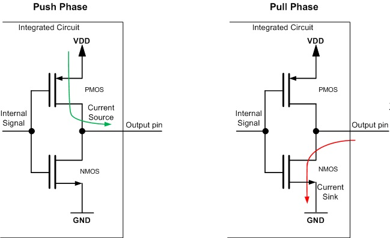
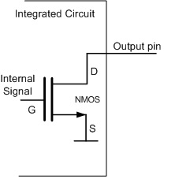
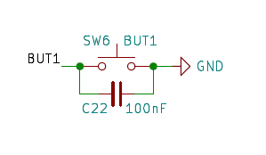
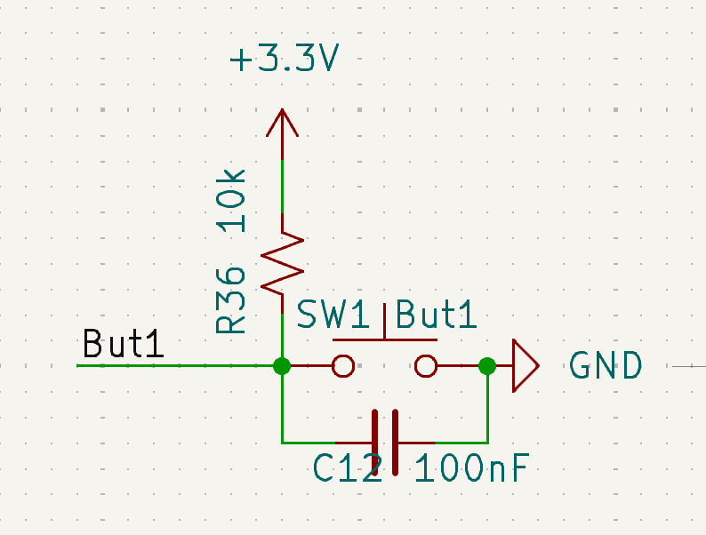
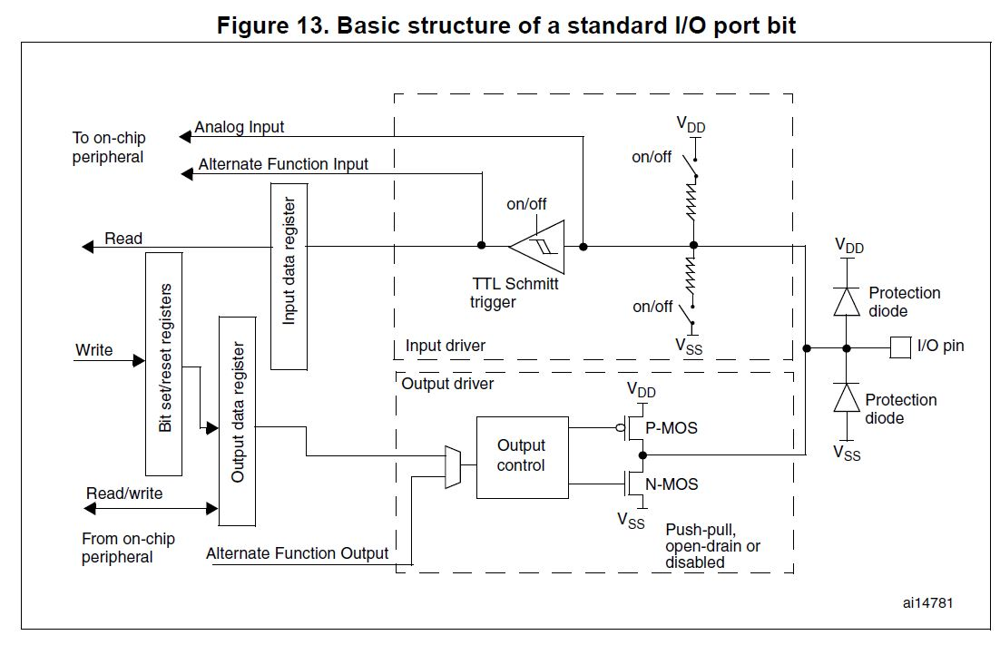

# Advanced GPIO

> This Tutorial Basically covers extended content of GPIO, that's is not well explained in the basic tutorial.

## GPIO Advanced Concepts

### GPIO Grouping Structure 
 <!-- Explain the GPIO grouping structure in STM32 microcontrollers, including ports and pins. -->
STM32 GPIOs are organized into ports (A, B, C, ...) each containing up to 16 pins numbered 0–15. Ports provide groups of pins that share pin-numbering and alternate-function mapping. Pins are addressed as Port+Pin (for example PA0, PB7).

### GPIO Configuration
<!-- Describe the different GPIO configuration modes (Input, Output Push-Pull, Output Open-Drain, Alternate Function, Analog). Also explain different Pull-up/Pull-down configurations. -->
Besides setting a pin to be an input pin or output pin, there are more settings that you can play around with.

#### 1. GPIO mode:

For output pins. you can set the output mode of the pin to be one of the following.

| Options | Description | Common use case |
|-----------|---------|-----------------|
| Output Push pull  | Can actively drive high and low through transitors |Standard digital outputs, driving LEDs |
| Output Open drain | Require external pull up resistor to achieve high | Sharing the same line with multiple devices, I2C (will be covered later) |

> Essentially Push Pull is that you have two transistors, one to pull the pin high and one to pull the pin low. And your pins would only drive to high or low, and nothing between.

> Open Drain is that you only have one transistor to pull the pin low, and when you want to set the pin high, you just let go of the pin and let the external pull-up resistor pull the pin high. So the pin can be low or high, but it can also be floating if there is no pull-up resistor.

#### 2. GPIO pull-up/pull-down:

<!-- For both input and output pins, you can also set the initial state of the GPIO to be high or low or even neither(floating).

| Options | Description | Common use case |
|---|---:|---|
| Pull‑Up | Weakly ties pin to VDD (reads as 1) | Buttons to GND; open‑drain safe default |
| Pull‑Down | Weakly ties pin to GND (reads as 0) | Buttons to VCC; define idle low |
| No Pull-up and no Pull-down| No internal bias (floating) | Analog inputs or externally biased signals -->

So we did mention something call pull-up resistors just now, so what is it? As you may see, at some time, your input pin maybe have chance that is not connected to anything, and in this case, the pin is floating, meaning it can randomly read high or low.

For example, you may take a look to the Schematics of your Demo board:

> When the button is pressed, it is surely connected to GND, and the pin will read low. 
> But when the button is not pressed, the pin is not connected to anything. (The cap is only to debounce the button signal.)
> And so in this case, the pin is floating and can randomly read high or low.

So it this case, what you really want is something like this:

> When the button is pressed, it is connected to GND, and the pin will read low.
> When the button is not pressed, the pin is connected to VCC through a resistor, and the pin will read high.
> 
> Ivan: this is drawn by me, so if hardware find there is any problem don't blame me :)

However, usually you won't see your hardware draw like this as it will increase their complexity of routing. Instead you would only see the first one, and the reason, you can do this pull up in your mcu by software.

In STM32, you can set a pin to be pull-up, pull-down, or no pull-up and no pull-down., essistially is to power the mosfet inside the mcu to connect the pin to VCC or GND through a resistor.

To achieve that, you just simply set the pin to be pull-up or pull-down in the ioc file.

#### 3. GPIO Alternate Functions:

GPIO pins can also be switched from simple digital I/O to an alternate function so the pin connects internally to a peripheral (UART, SPI, I2C, timers, etc.), allowing the peripheral to drive or read the pin directly. For example, during tutorial, if you tried to set up uart in the ioc file, you will see some pins are automatically set up for you to support uart.

Noted that the same pin can support multiple peripherals but only one alternate function at a time.

#### 4.GPIO Analog Function:

You can also configure a pin in analog mode disconnects the digital input/output buffers and routes the pin to analog peripherals such as ADC or DAC, reducing digital switching noise and input leakage so the pin can be used for accurate analog sampling or analog output. More on this in the next part (ADC).

### How to configure GPIO using STM32CubeMX
<!-- Provide a step-by-step guide on how to configure GPIO pins using STM32CubeMX. -->

While we have introduced once how to config a GPIO pins, you guys may still find it is not easy, you may consider to reference our guidelines of bonus homework here. This notes should provide you a overview on how to config the pin and more about the project.

[1.1-Setting-up-GPIO-Pin](./1.1-Setting-up-GPIO-Pin.md) 
