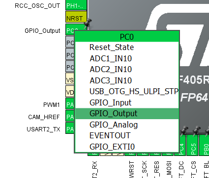
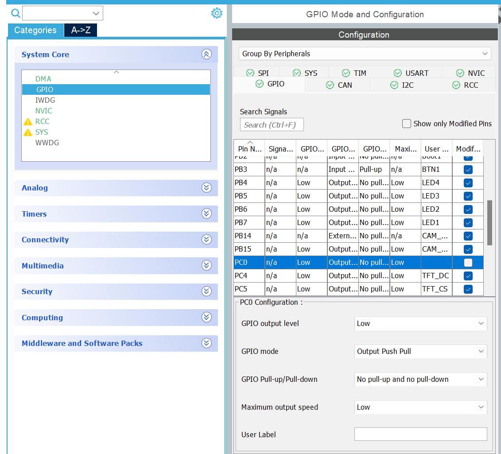
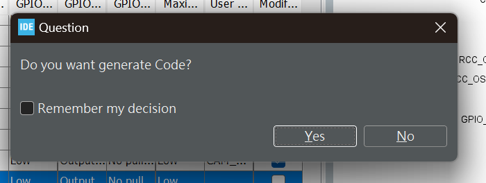

# Basic STM32 Configuration

> Please be **noted** that we are domostrating how to set up a new
GPIO **OUTPUT** pins for air cylinder.

Throughout your RDC journey, you will not need to configure all pinouts and function modules from scratch due to the many technical considerations involved. We have already provided you with a mostly completed configuration file called "SW Tutorial," which includes commonly used functionalities such as CAN, LED, TFT, and PWM.
However, you may still need to utilize some GPIO pins, and we cannot predict what and where you will connect to the board. Therefore, we will introduce some basic skills for setting up GPIO pins.

### Project Structure

In the project, you will commonly see a folder structure like this:

**Key Points:**

- The `includes` folder contains fundamental libraries that you should not modify. User-written headers should be stored in `/Core/Inc`.
- The `sw-tutorial.ioc` file opens the CubeMX GUI, a tool that allows you to configure different pinouts.
- Note that changes made in the configuration file will not take effect immediately. You must click "Generate Code" in CubeMX to apply the configuration.

### Configuration & Pinout Page

When you click the `.ioc` file, you will enter an interface similar to this:


- The leftmost panel is the **Module Panel**, where you can select all the available subsystems for the selected chip.
- The second panel from the left is the **Configuration Panel**, where you can access and set up detailed configurations.
- The main panel on the right is the **Pinout Panel**, where you can choose the purpose of each pin

### How to Configure a GPIO Pin

1. **Select the Pin**: Find the correct pin you want to connect, such as `PC0`, based on the hardware schematic.
2. **Assign Functionality**: Click on the pin and select the appropriate system/application you want to link it to:
   
3. **Configure the Pin**: Open the corresponding system module (in this case, `GPIO`) and locate the pin you just set up:
   
   - Inside this configuration window, you can choose different settings for the GPIO pin. Ideally, you should not need to change anything from the default configuration for a `GPIO Output` pin.
   - You can (and should) also rename the pin with a meaningful name. As mentioned in `02-GPIO.md`, CubeMX will generate the appropriate macro based on the name you enter, so you should rename it here instead of manually writing a macro.
4. **Save your configuration and Generate Code**:\
  As mentioned, you need to save and generate code before you can make your change effective. In CubeMX under CubeIDE, you just need to save your change by click `Ctrl + S` ~~(mac ppl help yourself)~~ and click **YES** in the following Pop-up Windows.
   
<!-- 5. **Bug Fixing**:
   - Comment the `MX_SPI_Init()` in `main.c`, due to some compilated reason, we have init the SPI in `tft_init()` and so double init may possibiy lead to some issue, therefore please help yourself and comment out this line:
      ```c
        /* main.c */
        /* Initialize all configured peripherals */
        MX_GPIO_Init();
        MX_DMA_Init();
        MX_CAN2_Init();
        // MX_SPI1_Init(); //Help us Comment out this line
        MX_USART1_UART_Init();
        MX_I2C2_Init();
        MX_CAN1_Init();
        MX_USART2_UART_Init();
        MX_TIM5_Init();
      ``` 
   - As the `tft_update()` is accidently put outside the designed zone for some destribution, your `tft_update()`, Please add the `tft_update(1)` in your main `while` loop if you don't find it there -->

## How to use the pins

After you generate the code, STM CubeIDE suppose will lead you back to the `main.c` or may be some other `.c` / `.h` files, if you want to check whther your code is generated correctly, you can do this:

Go to your `main.h`, you shoould able to find this:
```c
#define {the pin name you put}_Pin GPIO_Pin_{the pin number}
#define {the pin name you put}_GPIO_Port GPIO{The Pin Group}
```
For example I name my new pins as `Valve`, then in my `main.h` I find this:
```c
#define Valve_Pin GPIO_PIN_8
#define Valve_GPIO_Port GPIOB
```
> Please check if you do anything wrong if you cannot find or ask our senior, please **DO NOT** manually add this if you cannot find this!

After you confirm you have added this new pins, you can use it like how we use it before:

```c
// If it is a GPIO Output Pin, you can:
gpio_set(Valve); // Set the pin to HIGH
gpio_reset(Valve); // Reset the pin to LOW
gpio_toggle(Valve); // Toogle the pin

// If it is a GPIO Input Pin, you can:
uint8_t state = gpio_read(Valve);
```
At the meantime, we are not encouraged to use the `btn_read()` or `led_on()` or `led_off()` as we have mentioned before, we have flip the value of 0 and 1 for led and btn due to the hardware design, and so it may work somehow counter initative if you use it here.

---
> Here are some extended explanation about different mode of GPIO Input and Output, you can try understanding what is happening but no worries if you cannot understand all.

```c
void MX_GPIO_Init(void)
{

  GPIO_InitTypeDef GPIO_InitStruct = {0};

  /* GPIO Ports Clock Enable */
  __HAL_RCC_GPIOB_CLK_ENABLE();

  /*Configure GPIO pin Output Level */
  HAL_GPIO_WritePin(GPIOB, TFT_BL_Pin|CAM_WEN_Pin|CAM_RCLK_Pin|LED4_Pin
                          |LED3_Pin|LED2_Pin|LED1_Pin, GPIO_PIN_RESET);

  /*Configure GPIO pin : PtPin */
  GPIO_InitStruct.Pin = BTN1_Pin;
  GPIO_InitStruct.Mode = GPIO_MODE_INPUT;
  GPIO_InitStruct.Pull = GPIO_PULLUP;
  HAL_GPIO_Init(BTN1_GPIO_Port, &GPIO_InitStruct);

  /* EXTI interrupt init*/
  HAL_NVIC_SetPriority(EXTI15_10_IRQn, 0, 0);
  HAL_NVIC_EnableIRQ(EXTI15_10_IRQn);
}
```
