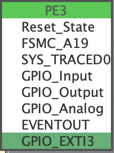
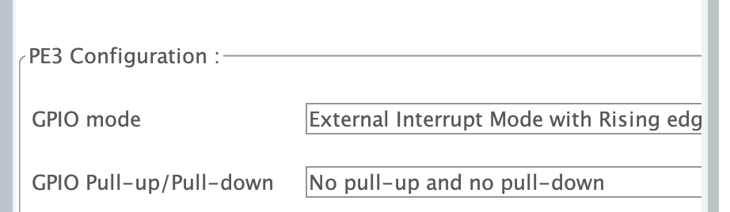
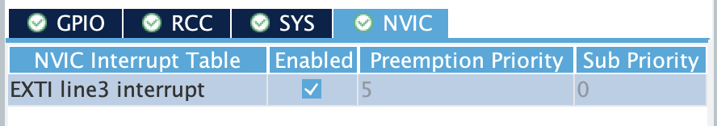
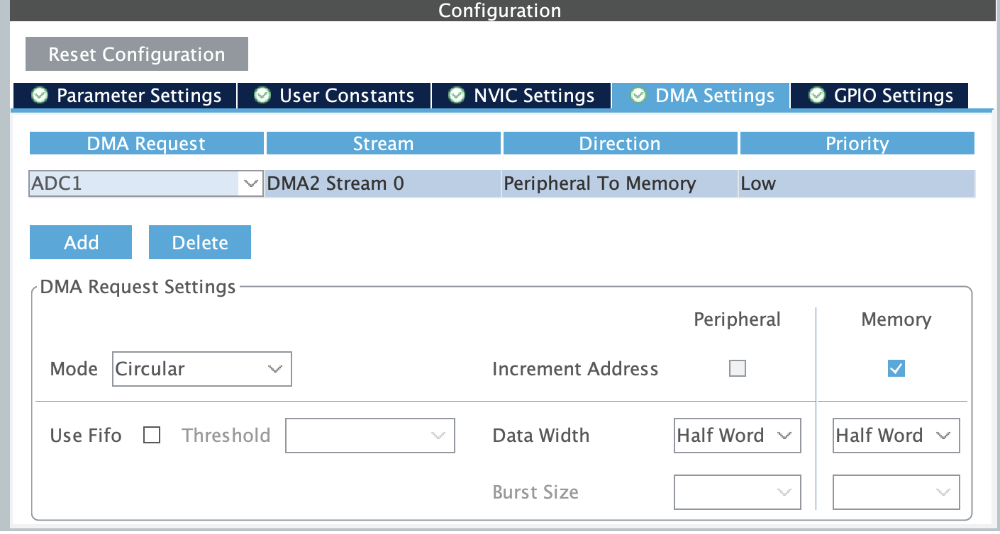

# Interrupt and DMA
[Back to home](./readme.md)
## What is an Interrupt?
<!-- Explain what is an interrupt and how it works in STM32 microcontrollers. -->
<!-- Explain using an example of GPIO interrupt -->

Remember in our tutorial 2, we mentioned blocking and interrupt in UART. But what actually is an interrupt?

A typical example to explain interrupt is a button and an LED.
> It is not exactly the same as the blocking problem in UART, but it is a good example to explain the concept of interrupt.

For example, if we want to turn on the LED when the button is pressed, and vice versa, you might code like this:

```c
while(1){
    if(HAL_GPIO_ReadPin(B1_GPIO_Port, B1_Pin) == GPIO_PIN_SET){
        HAL_GPIO_WritePin(LED_GPIO_Port, LED_Pin, GPIO_PIN_SET);
    } else {
        HAL_GPIO_WritePin(LED_GPIO_Port, LED_Pin, GPIO_PIN_RESET);
    }
}
```

This code basically means that in every loop, the CPU checks the button state. If it is pressed, it turns on the LED; otherwise, it turns off the LED. This is called **polling**. The problem with polling is that the CPU wastes a lot of time checking the button state (which, most of the time, does not change), and it blocks the CPU from doing other tasks.

So why not let the CPU (which is very powerful) use its time for other tasks, and only ask it to do something when the button is actually pressed? This is where **interrupts** come in.

The idea of an interrupt is that instead of wasting the CPU's time checking the button state, we let some simpler hardware do the checking for us. When the button is pressed, this hardware will interrupt the CPU and ask it to do something. This hardware is called the **NVIC (Nested Vectored Interrupt Controller)**.

A real-life analogy is your morning routine:
1. Wake up
2. Brush your teeth
3. Take a shower
4. Have breakfast
5. Go to work

However, you may get a call from your teammates, your girlfriend, or your mom. When any of them call you, your phone rings, and you need to stop your routine to answer the call. After the call, you can continue your routine.

One more thing: your phone (NVIC) is smart enough to differentiate who is calling you and assign different priorities. For example, while you are talking to your teammate, if your girlfriend calls, your phone will interrupt the teammate's call so you can answer your girlfriend. But if your teammate calls while you are talking to your girlfriend, your phone will ignore the teammate's call.

Of course, this smart function depends on whether you set the interrupt priorities correctly. For example, if you are indecisive and set both your girlfriend's and your mom's priorities to be the same, then if they call at the same time, your phone will just randomly pick one to answer.

But usually, you will not have so many interrupts in your application, so you do not need to worry about this too much.

> The blocking (UART) and polling (GPIO example) situations are actually a bit different.
> Blocking (UART): Here, you need to wait until UART finishes receiving its buffer before the function returns and you can do other things.
> Polling (GPIO): Here, you need to keep checking the button state. While it is not blocking, it is a waste of CPU time.


## Application of Interrupt
<!-- Demo using an GPIO Interrupt -->

> Ivan: This is directly stolen from internal tutorial I give to them, so if you find it a difficult to understand what I say, it is normal :)

So Let's try to use interrupt to reimplement the button and LED example.

> I purposely not making use of the example of UART Interrupt because suppose you can refers to the example of UART in the basic tutorial.

Let's demo interrupt with a basic GPIO Interrupt

1. You need to choose the pin as a `GPIO_EXTIX`:

    
2. In GPIO Setting, Set GPIO Mode as `External Interrupt Mode with ...` (Depends on whether you want it to enable at when)
    > Rising Edge: Actiavte only at the moment it from 0 to 1; Falling Edge: Actiavte only at the moment of it from 1 to 0

    
3. Under NVIC (Nested Vectored Interrupt Controller), you should be able to find this `EXTI` line interrupt, enable it

    

4. Under `stm32f4xx_it.c` you should be able to see the IRQ Handler CubeMX Created:
    ```c
    /**
    * @brief This function handles EXTI line3 interrupt.
    */
    void EXTI3_IRQHandler(void)
    {
    /* USER CODE BEGIN EXTI3_IRQn 0 */

    /* USER CODE END EXTI3_IRQn 0 */
    HAL_GPIO_EXTI_IRQHandler(BTN1_Pin); //Ivan: This is refering to the Default HAL GPIO IRQ Handler
    /* USER CODE BEGIN EXTI3_IRQn 1 */

    /* USER CODE END EXTI3_IRQn 1 */
    }
    ```

    Under `stm32f4xx_hal_gpio.c`, we can find this handler:
    ```c
    /**
    * @brief  This function handles EXTI interrupt request.
    * @param  GPIO_Pin Specifies the pins connected EXTI line
    * @retval None
    */
    void HAL_GPIO_EXTI_IRQHandler(uint16_t GPIO_Pin)
    {
    /* EXTI line interrupt detected */
    if(__HAL_GPIO_EXTI_GET_IT(GPIO_Pin) != RESET)
    {
        __HAL_GPIO_EXTI_CLEAR_IT(GPIO_Pin); // Clears The Interrupt Flag
        HAL_GPIO_EXTI_Callback(GPIO_Pin); // Calls The ISR Handler CallBack Function
    }
    }
    ```
5. Lets add our line on `EXTI3_IRQHandler`
    > ⭐️ Noted that some tutorial online may lead you to rewrite the `stm32f4xx_hal_gpio.c`, but if you carefully take a look, you will find it is under "Drivers" and so you know you should not edit it
    ```c
    /**
    * @brief This function handles EXTI line3 interrupt.
    */
    void EXTI3_IRQHandler(void)
    {
    /* USER CODE BEGIN EXTI3_IRQn 0 */
    gpio_toggle(LED2);
    /* USER CODE END EXTI3_IRQn 0 */
    HAL_GPIO_EXTI_IRQHandler(BTN1_Pin); //Ivan: This is refering to the Default HAL GPIO IRQ Handler
    /* USER CODE BEGIN EXTI3_IRQn 1 */

    /* USER CODE END EXTI3_IRQn 1 */
    }
    ```

### Remarks for Interrupt

1. Without the makeuse of RTOS, your interrupt handler have having way higher priority than your main loop, so if your interrupt handler is taking too long, then it would effect your main loop. In the other word, you should **keep your interrupt handler as short as possible**.
2. Some problems may occur if you are calling a function with interrupt function call in your interrupt handler.
   For example, some of you have faced the problem that the whole MCU no longer working, as you called `tft_updates()` in your interrupt handler, and `tft_updates()` will call SPI with interrupt.
3. You may also noticed that the number of `EXTI` is limited, and yes, it does, but no worries, you can still have a lot of way to handle, and you should not have so many GPIO Interrupt as well.

> In RDC, GPIO Interrupt is not really so useful, but we hope this example explain to you what is interrupt, and then when you want to use interrupt in other peripheral, you know what is it and have the capability to follow online tutorial.

## What is DMA?
<!-- Explain what is DMA and how it works in STM32 microcontrollers. -->
<!-- Explain using an example of memory-to-memory transfer  -->

If you did read some of the online tutorial, you may find that some of the peripheral (like UART, SPI, I2C, ADC, DAC) have a mode call DMA (Direct Memory Access). So what is DMA?

DMA is a hardware that can **transfer data** from one place to another place **without the need of CPU**. This means, CPU can free its time to do other tasks, while DMA is doing the data transfer job for us. 

In STM32, DMA is a very powerful hardware, it can transfer data from memory to memory, peripheral to memory, memory to peripheral. 

The most common use of DMA is peripheral to memory, for example, in UART, when you want to receive data from UART, you can use DMA to transfer the data from UART data register to a memory buffer. 

It can also be useful in ADC, when you want to read data from ADC, you can use DMA to transfer the data from ADC data register to a memory buffer. But we will cover how to use DMA in ADC in the next pages.

<!-- ## Application of DMA
<!-- Demo using an UART with DMA

### Configuration of DMA
<!-- Explain how to configure DMA in STM32CubeMX -->
<!-- Explain those detail parameters

Let's continue with our ADC example in session 2.

Go to ADC configuration, switch to "DMA Settings" tab, and then click "Add" to add a DMA channel.

For the mode, you can choose "Circular" or "Normal", the difference is, in "Normal" mode, when the DMA transfer is complete, it will stop, while in "Circular" mode, when the DMA transfer is complete, it will restart again.

Another important parameter is "Data Width", it should be the larger then or equal to the data width of the peripheral, for example, in ADC, you should set it larger then your resolution, which is 12 bits in our case, so you should set it to "Half-word (16-bit)".

So the result should be like this:


Going back to "Parameter Settings" tab, you should see the 

### How to code with DMA
<!-- Explain how to code with DMA in STM32CubeIDE 

After the configuration, CubeMX will generate the code for us. -->

### Further Study: UART with DMA

You can also try to use DMA with UART by yourself. The configuration is similar to ADC with DMA. You need to go to UART configuration, switch to "DMA Settings" tab, and then add a DMA channel for RX and TX respectively.

But however you may still have one question in your brain, how should I handle the message which does not have a fixed length? For example, if you are receiving a string from UART, how do you know when the string ends?

Hints: IDLE line detection interrupt. You can search online for more information about it. :)