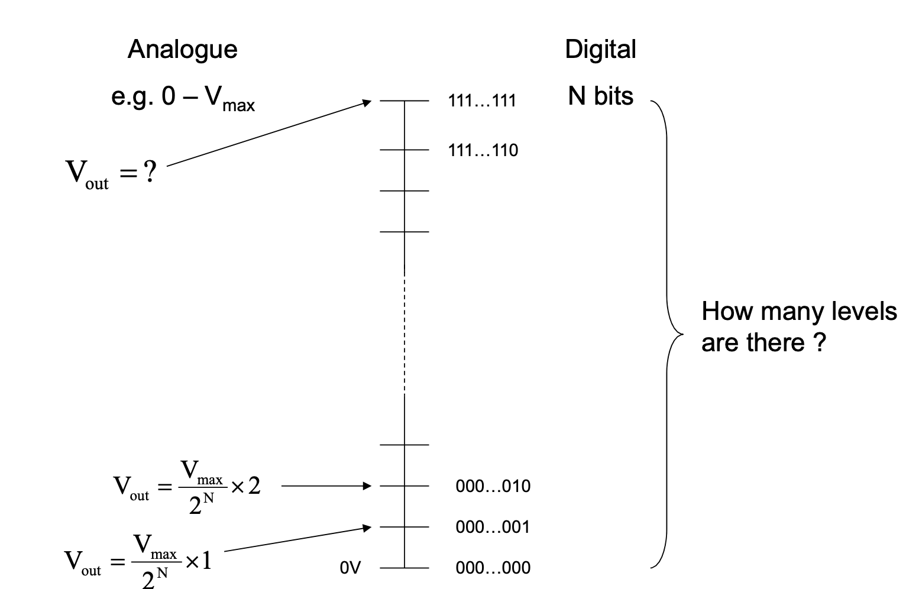
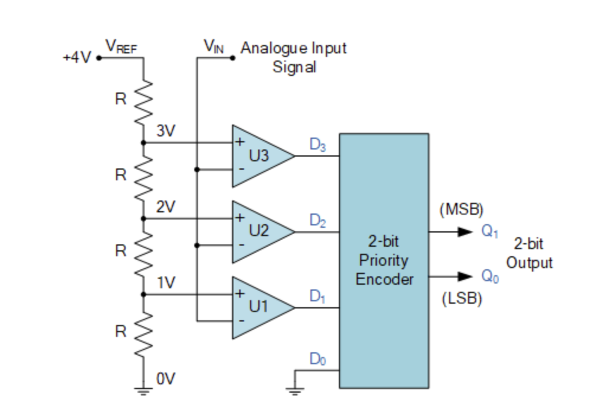
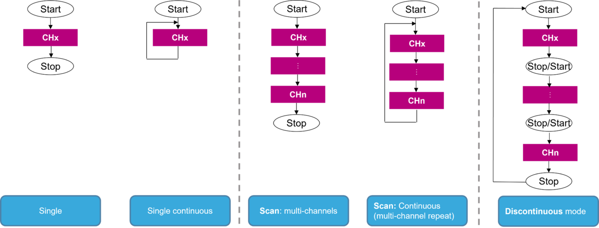
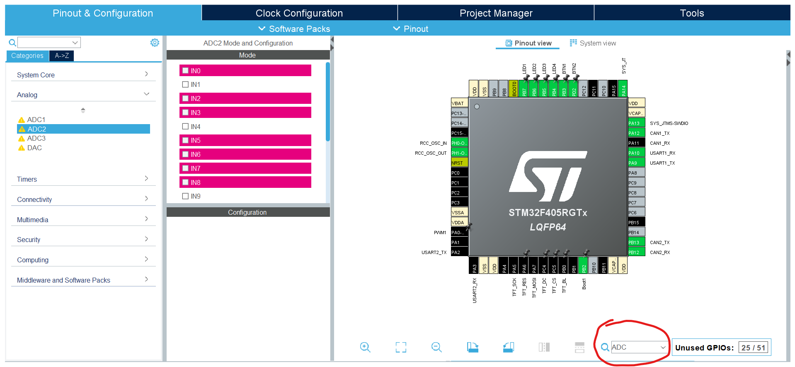
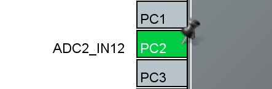
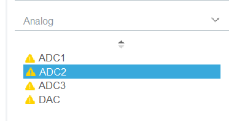
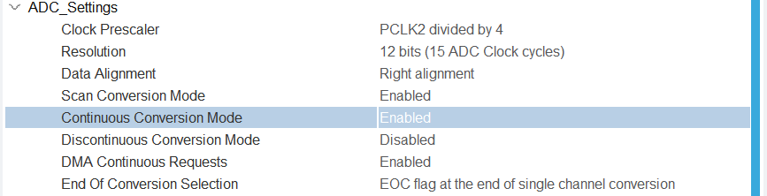
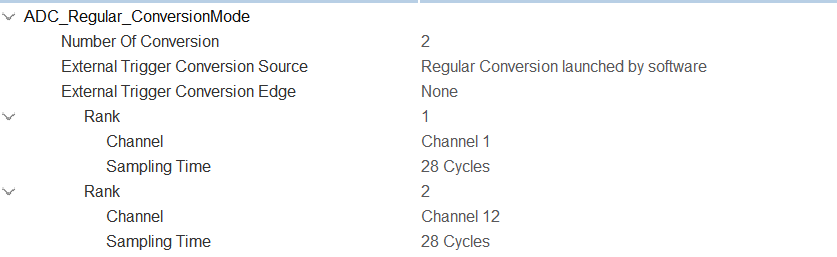
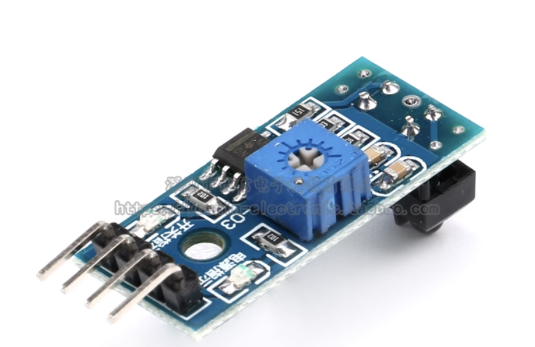
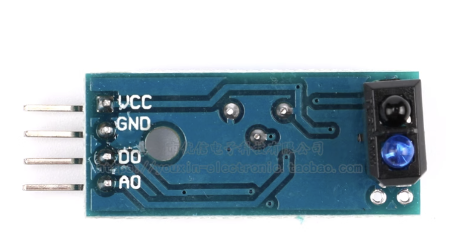

# Analog to Digital Converter (ADC)
[Back to home](./readme.md)
> As mentioned on the previous page, there is a mode called Analog Mode, which is used to read analog signals. But how do we read analog signals? The answer is: ADC.

## Analog Signal vs Digital Signal

| Feature   | Analog Signal     | Digital Signal   |
|-----------|-------------------|------------------|
| Nature      | Continuous        | Discrete (usually binary) |
| Representation | Continuous physical quantities (voltage, current, etc.) | A series of bits |
| Examples  | Light intensity, temperature | Control signals, communication protocols |
| Processing     | Cannot be directly processed by the MCU | Can be directly processed by the MCU |

As you can see, sometimes the data we want to analyze is represented by an analog signal. However, the MCU can only directly process digital signals. What should we do?

## What is ADC?
An analog-to-digital converter (ADC) converts a continuous analog voltage into a discrete digital value by sampling the input, holding the sample, quantizing its amplitude, and outputting a binary code.

How an ADC works:
- **Sampling:** The ADC samples the analog input at discrete time intervals using a sample-and-hold circuit.
- **Quantization:** The held voltage is compared to a range of digital levels and assigned to the nearest level.
- **Encoding:** The converter then encodes this discrete level into a binary number. The number of bits used for encoding determines the ADC's resolution and accuracy.

  
  > Reference: ELEC 3300 Tutorial

If you are really interested in how ADCs work, here is a simple 2-bit ADC for your reference:  
  
Basically, a 2-bit ADC would break 4V into `0V`, `1V`, `2V`, and `3V`, then round down the input voltage to the nearest voltage value, and return `00`, `01`, `10`, or `11` respectively.

For your MCU, $V_{ref}$ is 3.3V, so you can think about what the value means by the same idea.

## ADC Modes

Common ADC modes in STM32:

| Mode   | What it does   | Typical use   |
|-----------|-----------------------------|-------------------------------|
| Single conversion   | One sample and conversion on trigger, then stop | Occasional readings, simple polling |
| Continuous conversion  | Repeats conversions automatically after start | Continuous monitoring; usually used with DMA |
| Scan conversion  | Samples a configured list of channels in sequence | Multi-sensor acquisition; usually used with DMA |
| DMA continuous request | Continuous conversions with DMA transferring data to memory in circular mode without CPU intervention | High-speed data acquisition, buffering samples for processing |
| Discontinuous conversion  | Converts a subgroup of the scan per trigger | Timed/staged sampling, event-aligned conversions |



## How to Configure ADC

### Locate Pins that Support ADC

Open the `.ioc` file. In the bottom right corner, you should see a search bar. Type "ADC" and the pins that support ADC will be highlighted.



### Configure the Pins

Click on any unused pin that supports ADC, then select either ADC1_INx, ADC2_INx, or ADC3_INx. ADC1, ADC2, and ADC3 are the three converters in the MCU, and IN_x is the input channel of the respective ADC.

For example, if you choose PC2 and ADC2_IN12, it will be shown on screen like this:



> We recommend choosing the same ADC for all channels to simplify configuration.

### Configure ADC with DMA

Go to the left side of your screen and click "Analog".



Choose the ADC you used when configuring the pins. Then click "DMA Settings" and click "Add" to add a DMA channel.

For the mode, you can choose "Circular" or "Normal". In "Normal" mode, when the DMA transfer is complete, it will stop. In "Circular" mode, when the DMA transfer is complete, it will restart automatically. In this case, we suggest using "Circular".

Another important parameter is "Data Width". It should be greater than or equal to the data width of the peripheral. For example, for ADC, you should set it greater than or equal to your resolution. If you use the default resolution (12-bit), set it to "Half-word (16-bit)".

The result should look like this:  


Then click "Parameter Settings" and go to "ADC_Settings". For this tutorial, we recommend enabling continuous conversion mode, scan conversion mode, and DMA continuous request. You can also change the resolution, but remember to adjust the data width accordingly in the DMA settings.

The result should look like this:  


> You can use other modes if you want, but we won't cover how to configure and use them in this tutorial.

Next, go to "ADC_Regular_ConversionMode" and set "Number of conversion" to the number of input channels you want to scan in one cycle. If you set the number of conversions to 5, you should see 5 Ranks below. Set the input channel you want to scan in each rank and the sampling time of each channel. We recommend setting the sampling time to 28 cycles.

For example, if you want to scan channel 1 and 12, the result should look like this:  


After this, save the `.ioc` file and generate code.

In `main.c`, for each ADC you configured, initialize an array for storing the data. The size should be the same as the number of conversions for the respective ADC. Then, call the following function:
```c
HAL_StatusTypeDef HAL_ADC_Start_DMA(ADC_HandleTypeDef* hadc, uint32_t* pData, uint32_t Length)
```
Where `hadc` is the pointer to the ADC handler, `pData` is the array you defined for storing data, and `Length` is the size of the array.

For example, if you used ADC2 and the number of conversions is 5, you should write something like this:

```c
// main.c
...
uint32_t sensor_data[5];
...
int main() {
  ...
  HAL_ADC_Start_DMA(&hadc2, sensor_data, 5);
  ...
}
```

## Line Following Sensor



In your material lists, you would default have one line following sensors. The line following sensor have 4 pins, `GND`, `VCC` (3V3 - 5V), `AO`, `DO`



You should connect the `AO` pin to one of the ADC pins you configured before. The `AO` pin is the analog output pin, which will output a voltage between 0V to VCC (3.3V or 5V) depending on the reflectivity of the surface below the sensor. The darker the surface, the lower the voltage.

If you do not want to make use of Analog Signal, you can also use the `DO` pin, which is the digital output pin. The `DO` pin will output either HIGH (VCC) or LOW (GND) depending on the reflectivity of the surface below the sensor. You can adjust the sensitivity of the sensor by turning the screw on the sensor.

## Why Use DMA Instead of Just Using Interrupts? (Further Study)

Why do we need to use DMA with ADC? Why not just use interrupts?

Let's do some simple math. Suppose your ADC is running at $84\,\text{MHz} \div 4 = 21\,\text{MHz}$. For one sample, you take 28 cycles. So your ADC can sample at a speed of $21\,\text{MHz} \div 28 \approx 750\,\text{kHz}$. This means, if you are using interrupts, your interrupt handler will be triggered at a rate of 750 kHz. Even if your interrupt handler is just an empty function, it will consume the majority of your CPU time.

You can configure the ADC to trigger an interrupt only after a certain number of conversions, but it will still take up a lot of CPU time.

DMA allows data to be transferred directly from the ADC to memory without CPU intervention, freeing up the CPU for other tasks and enabling high-speed data acquisition.
