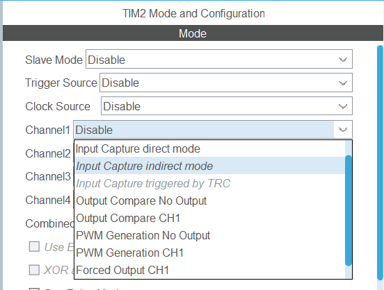
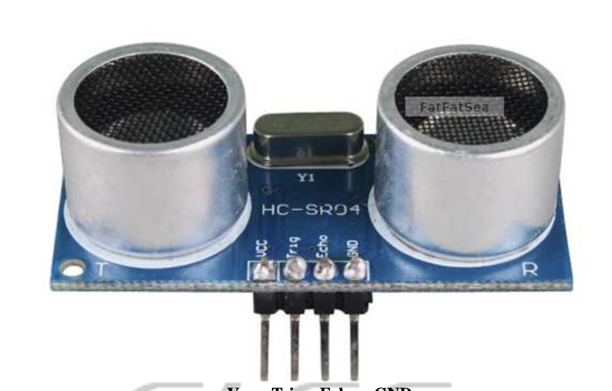
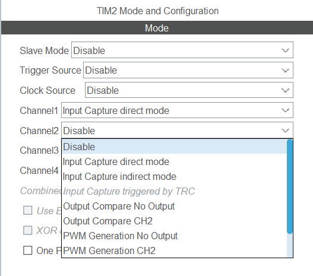
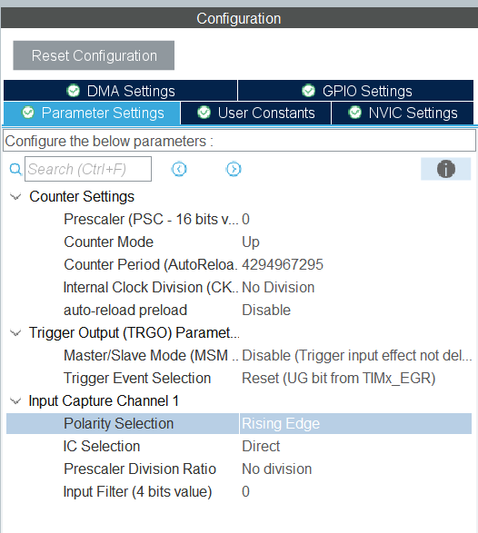
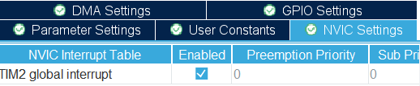

# Advanced Timer (Input capture)
[Back to home](./readme.md)
> During pervious tutorial we taught you guys how to generate a pwm signal given frequency and on-time. Can we do the reverse? (Spoiler: yes)

## Different modes for timer

If you open the ioc file and take a look into the timer settings, you can see that there is a lot of different mode for you.



In this tutorial we are going to focus on input capture

> ~~Specifically input capture direct mode~~

## What is input capture?

In Input capture mode, the MCU captures the timer's counter value on specific signal edges (rising, falling, or both).

This mode is useful for applications like motor control, signal analysis, or interfacing with sensors that output PWM signals. You can calculate the pulse width or frequency of the input in time-based measurement to further decode the message behind it.

## Theory

As mentioned, there are two main characteristics of a pwm signal we want to investigate (period and pulse width). Let's talk about how to get them.

First of all, let's talk about pulse width. For pulse width, you want to measure the time difference between each rising edge and falling edge. To get this we first count how many times the counter increment its value during this period. We can easily get this by finding the difference between the counter values recorderd during falling edge and rising edge respectively. 

Then, recall the counter value will increment by 1 in one clock cycle of the "scaled down" clock. The scaled down clock has a frequency is:

$\frac{MCU\space Clock\space frequency}{Prescaler\space Value+1}$ 

Assume that the counter increment by $x$, the corresponding pulse width is:

$x*\frac{Prescaler\space Value+1}{MCU\space Clock\space frequency}$ 

Additionally, since the pulse width is very short if the frequency is high, we usually represent the pulse width in us. Hence, the final formula for pulse width should be:

$1000000x*\frac{Prescaler\space Value+1}{MCU\space Clock\space frequency}$ 

You can also find the frequency using similar logic.

## Ultrasonic Sensor Application

You may take a look to the [Datasheet of HC-SR04 Ultrasonic Sensor](./image/HCSR04.pdf).



There is two main pins you need to care about, "Trig" and "Echo".
- Trig: Trigger input. A high pulse of at least 10µs is required to initiate the measurement.
- Echo: Echo output. The duration of the high pulse on this pin corresponds to the time taken for the ultrasonic signal to travel to the object and back.

Your TODOs:
1. Set up the Trig pin as GPIO output, and Echo pin as Timer Input Capture
2. Generate a high pulse of at least 10µs on Trig pin to start (How you can do so?)
3. Use Input Capture to measure the duration of the high pulse on Echo pin
4. Calculate the distance using formula

## Configuration

There are a few things that you need to configure.

Firstly, click on any channel you want and set it to "Input capture direct mode"



Then, in parameter setting, set the PSC values, ARR values and polarity selection. Set the corresponding parameters to appropiate values. (Hints: consider resolution, overflow and what you try to detect)



Lastly, enable timer interrupt.


 
## Code

```
// main.c
uint8_t prev_state = 0;
uint32_t first_capture = 0;
uint32_t second_capture = 0;

uint8_t prev_but_state = 0;
uint8_t cur_but_state = 0;

void HAL_TIM_IC_CaptureCallback(TIM_HandleTypeDef *htim)
{
  if(htim == &htim1){
     if(!prev_state){ // if previously is low, then this is a rising edge
        first_capture = HAL_TIM_ReadCapturedValue(htim, TIM_CHANNEL_1);
        prev_state = 1;
      }else{ // else it is a falling edge
        second_capture = HAL_TIM_ReadCapturedValue(htim, TIM_CHANNEL_1);
        prev_state = 0;
      }
  }
}

int main(){
  ...
  HAL_TIM_IC_START_IT(&htim1, TIM_CHANNEL_1);
  ...
  while(1){
    cur_but_state = btn_read(BTN1);
    if(prev_but_state != cur_but_state && cur_but_state){
       gpio_set(TOG);
       HAL_Delay(1);
       gpio_reset(TOG);
     }
     tft_prints(0, 0, "%d", first_capture);
     tft_prints(0, 1, "%d", second_capture);
     tft_update(1);
    prev_but_state = cur_but_state; 
  }
}
```

```
//main.c

void HAL_TIM_IC_CaptureCallback(TIM_HandleTypeDef *htim)
{
  // implement your logic here
  // remember to consider overflow!!!!!
  ...
}

int main(){
  ...
  HAL_TIM_IC_Start_IT(&htim2, TIM_CHANNEL_1);
  ...
}
```

You may find the following API useful

```
uint32_t HAL_TIM_ReadCapturedValue(const TIM_HandleTypeDef *htim, uint32_t Channel)
```

Description:

Returns the value stored in the timer capture/compare register for the specified channel. Use this to obtain the timestamp recorded by the timer when an input-capture event occurred.

Parameters:
- htim — pointer to a TIM handle that identifies the timer instance (e.g., &htim2).
- Channel — capture channel identifier constant (e.g., TIM_CHANNEL_1, TIM_CHANNEL_2, TIM_CHANNEL_3, TIM_CHANNEL_4).

Return value:
- uint32_t containing the current contents of the capture/compare register CCRx for the selected channel. The returned width depends on the timer peripheral (typically 16-bit for some timers, 32-bit on timers with 32-bit CCR registers); the API returns it extended into a 32-bit value.

```
#define __HAL_TIM_SET_CAPTUREPOLARITY(__HANDLE__, __CHANNEL__, __POLARITY__)
```
Description:

Sets the input-capture polarity for a given timer channel by modifying the timer CCER register bits for that channel. It controls whether captures are triggered on rising edges, falling edges, or both (when supported by the timer) and also handles complementary channel polarity bits on timers that have them.

Parameters:

- __HANDLE__ — pointer to a TIM handle that identifies the timer instance (e.g., &htim2).
- __CHANNEL__ — capture channel identifier constant (e.g., TIM_CHANNEL_1, TIM_CHANNEL_2, TIM_CHANNEL_3, TIM_CHANNEL_4).
- __POLARITY__  — the polarity you want to change
Return value:

N/A

For overflow issue, you may reference 

```
void HAL_TIM_PeriodElapsedCallback(TIM_HandleTypeDef *htim){
...
}
```
This is another callback function which will be triggered when overflow is detected.

