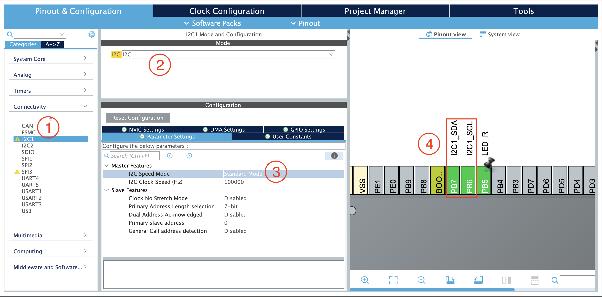

# Inter-Intergrated Circuit (I2C)
[Back to home](./readme.md)
## What is I2C?
I2C is a two-wire serial communication system used between integrated circuits. It is a multi-master, multi-slave, synchronous, bidirectional, half-duplex serial communication bus.
- **SDA (Serial Data)** is the line on which master and slave send or receive the information (sequence of bits).
- **SCL (Serial Clock)** is the clock-dedicated line for data flow sychronization.

### I2C vs UART

| Features   | I2C     | UART    |
|-----------|---------|---------|
| Type      | Synchronous | Asychronous |
| Wires     | SCL, SDA | TX, RX |
| Topology  | Bus (multi-master/slave) | Point-to-point |
| Speed     | 100 kbps - 1 Mbps | $\ge$ 4 Mbps |
| Addressing | Yes (7/10-bit) | No |
| Complexity | Higher (bus management) | Lower (simple data transfer) |
| Error Detection | ACK/NACK, arbitration | Optional parity bits |
| Use Cases | Sensors, EEPROMs, Displays | PC interface, GPS, Debugging |

In short, choose **I2C** for scenarios requiring multiple devices on a single bus with moderate rates, such as sensor arrays. Use **UART** for high-speed, point-to-point communication,like serial debugging or module interfacing.

## How to Configure I2C?



1. Under **Connectivity**, select **I2C1/2/...**
2. Select the **Mode** as **I2C**
3. Set the **Speed Mode** and **Clock Speed/Speed Frequency**
   - **Standard-Mode (Sm)** with a bit rate up to 100 kbps/kHz
   - **Fast-Mode (Fm)** with a bit rate up to 400 kbps/kHz
   - **Fast-Mode Plus (Fm+)** with a bit rate up to 1 Mbps/MHz
4. (Optional) Hold the **"Ctrl/control+left click"** to show alternate pin(s) and drag to the available pin

> Actually, I2C data transfer can be performed in 3 modes: Polling Mode, Interrupt Mode or DMA Mode (Similar to UART). DMA is the fastest and the most efficient among them because it free the CPU from doing the data transfers between peripheral and memory.

5. Press **"Ctrl/command+S"** to generate the project

## HAL Functions 

> In case, you do not know what is HAL. In fact, they are the application programming interfaces (APIs) provided by a Hardware Abstraction Layer (HAL) to allow software to interact with a system's hardware in a standardized, portable way.

```C
// Automatically generated in main.c by CubeMX
I2C_HandleTypeDef hi2c1;

/**
* @brief Read an amount of data in blocking mode from a specific memory address
* @param hi2c Pointer to a I2C_HandleTypeDef structure that contains
* the configuration information for the specified I2C.
* @param DevAddress Target device address: The device 7 bits address value
* in datasheet must be shifted to the left before calling the interface
* @param MemAddress Internal memory address
* @param MemAddSize Size of internal memory address
* @param pData Pointer to data buffer
* @param Size Amount of data to be sent
* @param Timeout Timeout duration
* @retval HAL status
*/
HAL_StatusTypeDef HAL_I2C_Mem_Read(I2C_HandleTypeDef *hi2c, uint16_t
DevAddress, uint16_t MemAddress, uint16_t MemAddSize, uint8_t *pData,
uint16_t Size, uint32_t Timeout);

// If you want to read one byte stored in address 0x6C at HMC5883L – Compass (DevAddress is 0x1E), using I2C1
uint8_t data = 0;
HAL_I2C_Mem_Read(&hi2c1,0x1E<<1,0x6C,1,&data,1,100);

/**
* @brief Write an amount of data in blocking mode to a specific memory address
* @param hi2c Pointer to a I2C_HandleTypeDef structure that contains
* the configuration information for the specified I2C.
* @param DevAddress Target device address: The device 7 bits address value
* in datasheet must be shifted to the left before calling the interface
* @param MemAddress Internal memory address
* @param MemAddSize Size of internal memory address
* @param pData Pointer to data buffer
* @param Size Amount of data to be sent
* @param Timeout Timeout duration
* @retval HAL status
*/
HAL_StatusTypeDef HAL_I2C_Mem_Write(I2C_HandleTypeDef *hi2c, uint16_t
DevAddress, uint16_t MemAddress, uint16_t MemAddSize, uint8_t *pData,
uint16_t Size, uint32_t Timeout);

// If you want to write one byte (say, 0xFF) to address 0x30 on HMC5883L (DevAddress is 0x1E), using I2C1
data = 0xFF;
HAL_I2C_Mem_Write(&hi2c1,0x1E<<1,0x30,1,&data,1,100);
```

> A small technique is that you can view the details of the HAL (any) functions by hovering your cursor on the function or press "Ctrl/command+right click" to jump to the function implementation.

## Time-of-Flight (ToF) Sensor

- To measure distance by calculating the time it takes for a laser pulse to be emitted, reflected off an object, and return to the sensor.
- Communication Protocol: I2C
- For your reference, please check the details in [Datasheet](./image/vl53l1.pdf)
- You may also find this API manual useful: [API Manual](./image/um2356-vl53l1x-api-user-manual-stmicroelectronics.pdf)

> This is the reason why we teach I2C :) Guess what? We generously provide the library so you do not need to implement the low-level stuff (which you will later) 

### How to add the ToF Library to your project? 

> Understand the library by yourselves :)

- Driver 
  - vl53l1_API
  - ...
- Core
  - Src
    - source files (.c)
    - ...
  - Inc
    - header files (.h)
    - ...

### A Simple and Lightweight Task for You

```C
/**
 * @brief  Regular sample from the VL53L1 ToF sensor.
 * @param  dev Pointer to the VL53L1 device structure.
 * @retval Status of the operation (0 for success, non-zero for error).
 */
uint8_t tof_regular_sample(tof_vl53l1_dev_t *dev) {
   /* To Do List:
    * 1. Check if the data is ready
    * 2. Get the range status and return error if range status is not zero
    * 3. Get distance
    * 4. Get signal rate
    * 5. Get ambient rate 
    * 6. Get the number of enabled SPADs
    * 7. Return success
    */
}
```


## Further Reading Extracted from ELEC3300

> The Best Embedded System course taught by our supervisor, **Professor Woo**

### Typical Connection


### Architecture

Master Device
- Initiates a transaction on the I2C bus
- Controls the clock signal 
- Possible to have multiple masters, but most system designs have only one.
  
Slave Deives
- Addressed by the master device
  
Both masters and slaves can receive and transmit data bytes

### Block Diagram 


> What are the HAL functions actually doing underneath / at low level? 

### Write Timing Diagram 


1. Send a start sequence 
2. Send the I2C address of the slave with the R/W bit low (even address)
3. Send the internal register number you want to write to 
4. Send the data byte 
5. (Optional) Send any further data bytes
6. Send the stop sequence

> Note: You need to check the status after each step

### Read Timing Diagram


1. Send a start sequence 
2. Send the read address with the R/W bit low (even address)
3. Send the lower read address 
4. Send a start sequence again (repeated start) 
5. Send the read address with the R/W bit high (odd address)
6. Read data byte
7. Send the stop sequence

> Note: You need to check the status after each step


