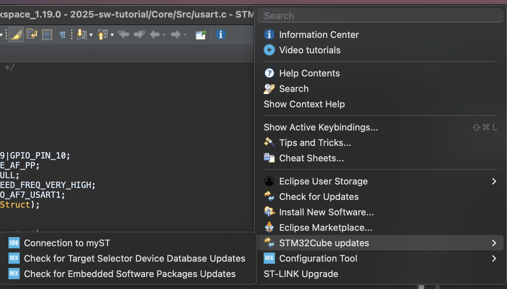

# Advanced Tutorial 1: Advanced Embedding System

> Speedrunning all the embedded systems knowledge you need to know
> and maybe the knowledge you don't need to know

|Date| Time |Venue|
|----|------|-----|
|17 Oct (Friday) | 1900 - 2200 | Room 4582 |
|20 Oct (Monday) | 1900 - 2200 | Room 4582 |

## Pre-requisite

### Create and log in to ST account in STM32CubeIDE

First, please go to [ST Offical Website](https://www.st.com/content/st_com/en.html) and create an account.

It may take some time for you to receive the confirmation email.

After that get back to your STM32CubeIDE and log in with your account.

Go to `Help-> STM32CubeUpdate -> Connection to my ST`, login your account there, you are good to go.

## Agenda

1. [Advanced GPIO](./1-Advanced_GPIO.md)
2. [Interrupts and DMA](./2-Interrupt_DMA.md)
   * Demo: Button with Interrupt
3. [Analog to Digital Converter (ADC)](./3-ADC.md)
   * Exercise: Read Line Following Sensor with ADC DMA
4. [Advanced Timer (Input Capture)](./4-Advanced_Timer.md)
   * Frequency Measurement
   * Ultrasonic Sensor
5. [I2C](./5-I2C.md)
   * TOF (Vl53L1X)