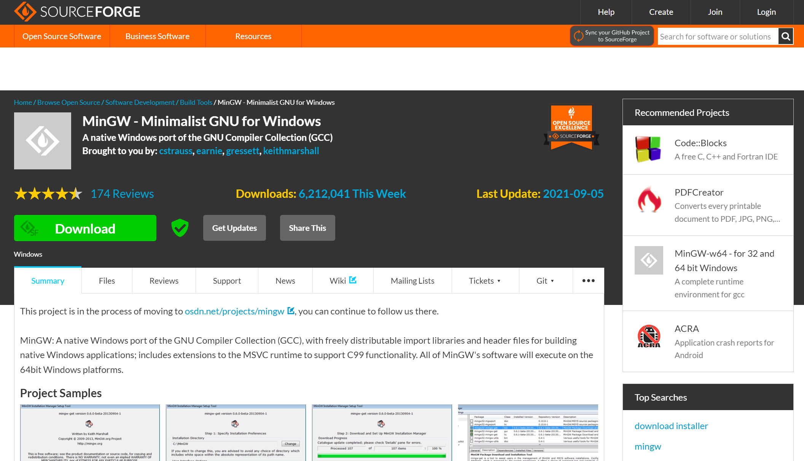
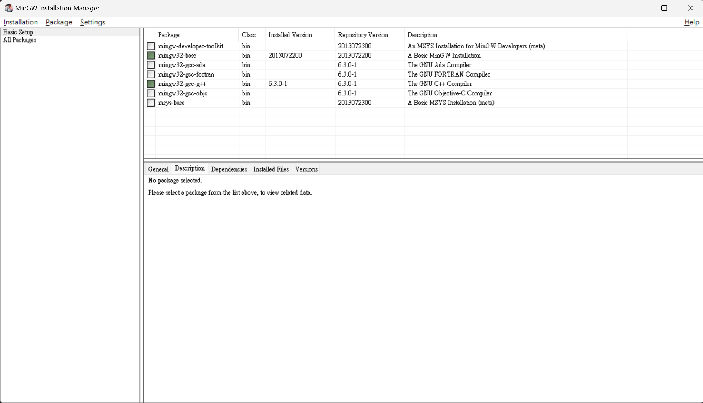
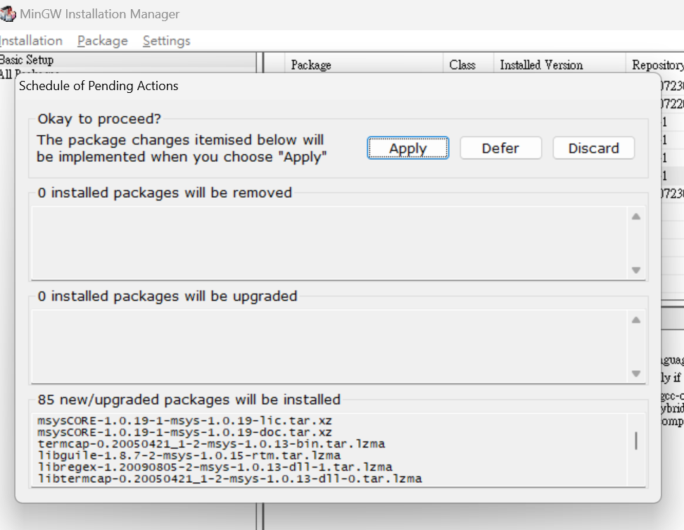
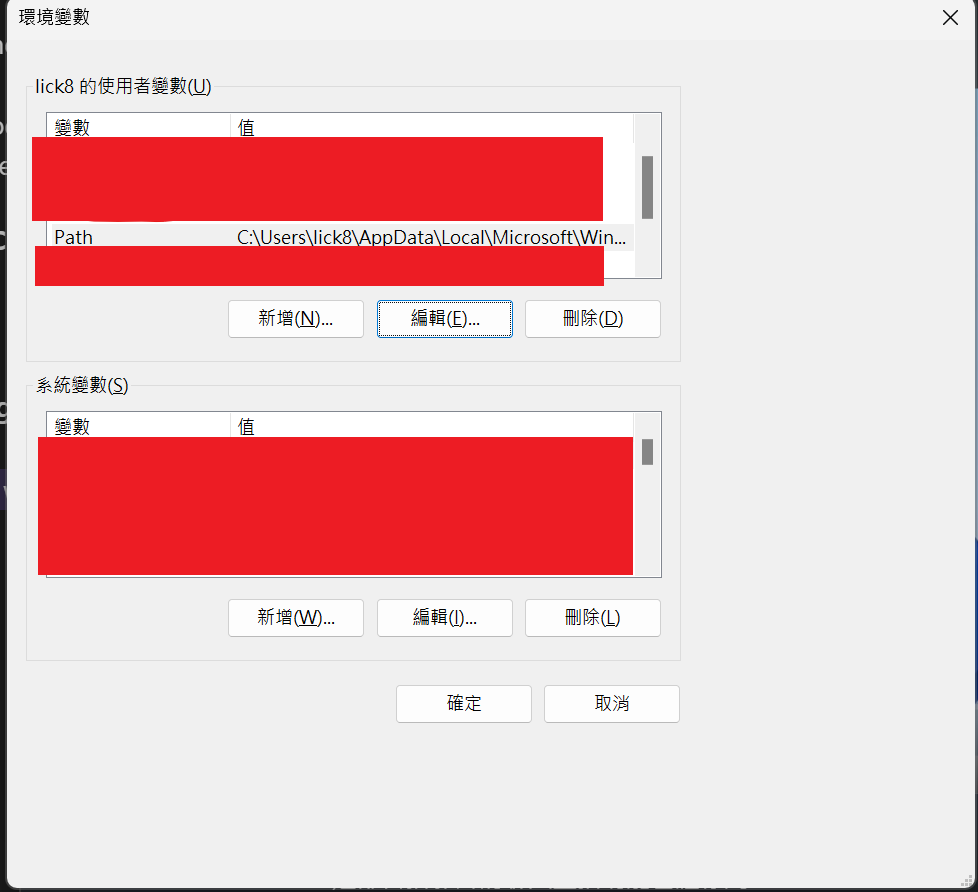

# Installing Compiler (for Windows)

Authors

Li Chi Kin Andy

> Note: For the purposes of our tutorials you aren't required to install a compiler since for the most part we will be using STM32CubeIDE which comes with everything you need, and the tasks for tutorial 1 should be doable with an online IDE. However, we have seen cases where Windows users need to install a compiler on their own to make CubeIDE work properly, so this is here for reference. More info/instructions for Mac/Linux should be easily found on Google if you're into that.

Windows OS does not have any C/C++ compiler installed by default. This chapter teaches you how to install the MinGW C/C++ compiler. The whole process should take around **10-20 minutes**.

## Step 1

Go to this website [https://sourceforge.net/projects/mingw/](https://sourceforge.net/projects/mingw/) download the compiler

## Step 2

2.1) Open the downloaded setup tool, press the Install and Continue button, and you will reach this interface.

2.2) Select all packages by clicking 'Mark for Installation', go to Installation (at the top left corner), and click 'Apply Changes'.&#x20;

2.3) Start downloading packages

## Step 3

Copy the path of your Mingw to the environment variable

3.1) Search PATH in windows

3.2) Click on 'Edit the system environment variables', in Chinese,'編輯系統環境變數'.

3.3) Add C:\MinGW\bin to PATH

## Step 4

To test whether the installation is successful, type `g++ --version` in the terminal to check.

.png>)

##

#### Congratulations 🎉🎉 you have successfully installed the MinGW C/C++ compiler!!

## Reference

[https://www.youtube.com/watch?v=FEeFG9OR-QU\&ab\_channel=GeekyScript](https://www.youtube.com/watch?v=FEeFG9OR-QU\&ab\_channel=GeekyScript)

&#x20;
