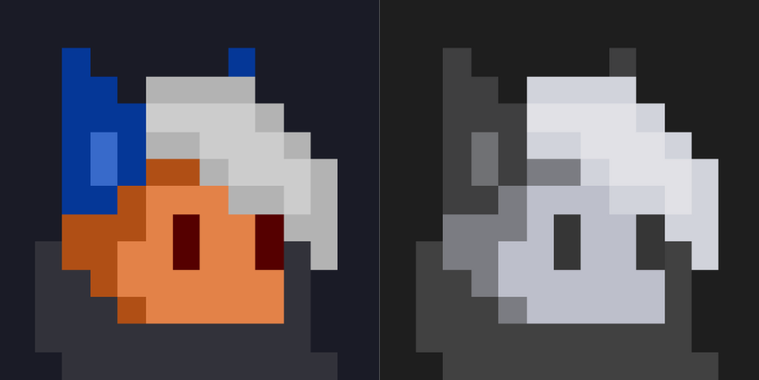

[Back to Main](../README.md)

# Classwork 4: Grayscale Filter

When you open an image on your computer, you usually can open an editor menu to apply a grayscale filter on it. For example this is the image of someone's discord profile (will be used for classwork because it is a pixel art and easier to check):



In general, you can apply grayscale by multiplying each red, green, and blue color value of the image by some luminance constant. The formula is shown as the following:

$$V = 0.2989 \cdot R + 0.5870 \cdot G + 0.1140 \cdot B$$

Then please round the value *down* to the nearest integer and print it out for each pixel separated by spaces. If you have finished on row of the image, print a newline. Please also refer to the the sample output below for the spacing format.


This is the image written as a matrix of `Color` struct:

```c
typedef struct{
    int R;
    int G;
    int B;
} Color;

Color image[15][15] = {
    {{26 , 27 , 38 }, {26 , 27 , 38 }, {26 , 27 , 38 }, {26 , 27 , 38 }, {26 , 27 , 38 }, {26 , 27 , 38 }, {26 , 27 , 38 }, {26 , 27 , 38 }, {26 , 27 , 38 }, {26 , 27 , 38 }, {26 , 27 , 38 }, {26 , 27 , 38 }, {26 , 27 , 38 }, {26 , 27 , 38 }, {26 , 27 , 38 }},
    {{26 , 27 , 38 }, {26 , 27 , 38 }, {26 , 27 , 38 }, {26 , 27 , 38 }, {26 , 27 , 38 }, {26 , 27 , 38 }, {26 , 27 , 38 }, {26 , 27 , 38 }, {26 , 27 , 38 }, {26 , 27 , 38 }, {26 , 27 , 38 }, {26 , 27 , 38 }, {26 , 27 , 38 }, {26 , 27 , 38 }, {26 , 27 , 38 }},
    {{26 , 27 , 38 }, {26 , 27 , 38 }, {26 , 27 , 38 }, {26 , 27 , 38 }, {26 , 27 , 38 }, {26 , 27 , 38 }, {26 , 27 , 38 }, {26 , 27 , 38 }, {26 , 27 , 38 }, {26 , 27 , 38 }, {26 , 27 , 38 }, {26 , 27 , 38 }, {26 , 27 , 38 }, {26 , 27 , 38 }, {26 , 27 , 38 }},
    {{26 , 27 , 38 }, {26 , 27 , 38 }, {26 , 27 , 38 }, {5  , 55 , 151}, {26 , 27 , 38 }, {26 , 27 , 38 }, {26 , 27 , 38 }, {26 , 27 , 38 }, {26 , 27 , 38 }, {5  , 55 , 151}, {26 , 27 , 38 }, {26 , 27 , 38 }, {26 , 27 , 38 }, {26 , 27 , 38 }, {26 , 27 , 38 }},
    {{26 , 27 , 38 }, {26 , 27 , 38 }, {26 , 27 , 38 }, {5  , 55 , 151}, {5  , 55 , 151}, {26 , 27 , 38 }, {179, 179, 179}, {179, 179, 179}, {179, 179, 179}, {179, 179, 179}, {26 , 27 , 38 }, {26 , 27 , 38 }, {26 , 27 , 38 }, {26 , 27 , 38 }, {26 , 27 , 38 }},
    {{26 , 27 , 38 }, {26 , 27 , 38 }, {26 , 27 , 38 }, {5  , 55 , 151}, {5  , 55 , 151}, {5  , 55 , 151}, {204, 204, 204}, {204, 204, 204}, {204, 204, 204}, {204, 204, 204}, {179, 179, 179}, {26 , 27 , 38 }, {26 , 27 , 38 }, {26 , 27 , 38 }, {26 , 27 , 38 }},
    {{26 , 27 , 38 }, {26 , 27 , 38 }, {26 , 27 , 38 }, {5  , 55 , 151}, {56 , 106, 202}, {5  , 55 , 151}, {179, 179, 179}, {179, 179, 179}, {204, 204, 204}, {204, 204, 204}, {204, 204, 204}, {179, 179, 179}, {26 , 27 , 38 }, {26 , 27 , 38 }, {26 , 27 , 38 }},
    {{26 , 27 , 38 }, {26 , 27 , 38 }, {26 , 27 , 38 }, {5  , 55 , 151}, {56 , 106, 202}, {5  , 55 , 151}, {176, 79 , 21 }, {176, 79 , 21 }, {179, 179, 179}, {204, 204, 204}, {204, 204, 204}, {204, 204, 204}, {179, 179, 179}, {26 , 27 , 38 }, {26 , 27 , 38 }},
    {{26 , 27 , 38 }, {26 , 27 , 38 }, {26 , 27 , 38 }, {5  , 55 , 151}, {5  , 55 , 151}, {176, 79 , 21 }, {227, 130, 72 }, {227, 130, 72 }, {227, 130, 72 }, {179, 179, 179}, {179, 179, 179}, {204, 204, 204}, {179, 179, 179}, {26 , 27 , 38 }, {26 , 27 , 38 }},
    {{26 , 27 , 38 }, {26 , 27 , 38 }, {26 , 27 , 38 }, {176, 79 , 21 }, {176, 79 , 21 }, {176, 79 , 21 }, {227, 130, 72 }, {85 , 0  , 0  }, {227, 130, 72 }, {227, 130, 72 }, {85 , 0  , 0  }, {179, 179, 179}, {179, 179, 179}, {26 , 27 , 38 }, {26 , 27 , 38 }},
    {{26 , 27 , 38 }, {26 , 27 , 38 }, {50 , 50 , 58 }, {176, 79 , 21 }, {176, 79 , 21 }, {227, 130, 72 }, {227, 130, 72 }, {85 , 0  , 0  }, {227, 130, 72 }, {227, 130, 72 }, {85 , 0  , 0  }, {50 , 50 , 58 }, {179, 179, 179}, {26 , 27 , 38 }, {26 , 27 , 38 }},
    {{26 , 27 , 38 }, {26 , 27 , 38 }, {50 , 50 , 58 }, {50 , 50 , 58 }, {176, 79 , 21 }, {227, 130, 72 }, {227, 130, 72 }, {227, 130, 72 }, {227, 130, 72 }, {227, 130, 72 }, {227, 130, 72 }, {50 , 50 , 58 }, {26 , 27 , 38 }, {26 , 27 , 38 }, {26 , 27 , 38 }},
    {{26 , 27 , 38 }, {26 , 27 , 38 }, {50 , 50 , 58 }, {50 , 50 , 58 }, {50 , 50 , 58 }, {176, 79 , 21 }, {227, 130, 72 }, {227, 130, 72 }, {227, 130, 72 }, {227, 130, 72 }, {227, 130, 72 }, {50 , 50 , 58 }, {26 , 27 , 38 }, {26 , 27 , 38 }, {26 , 27 , 38 }},
    {{26 , 27 , 38 }, {26 , 27 , 38 }, {50 , 50 , 58 }, {50 , 50 , 58 }, {50 , 50 , 58 }, {50 , 50 , 58 }, {50 , 50 , 58 }, {50 , 50 , 58 }, {50 , 50 , 58 }, {50 , 50 , 58 }, {50 , 50 , 58 }, {50 , 50 , 58 }, {26 , 27 , 38 }, {26 , 27 , 38 }, {26 , 27 , 38 }},
    {{26 , 27 , 38 }, {26 , 27 , 38 }, {26 , 27 , 38 }, {50 , 50 , 58 }, {50 , 50 , 58 }, {50 , 50 , 58 }, {50 , 50 , 58 }, {50 , 50 , 58 }, {50 , 50 , 58 }, {50 , 50 , 58 }, {50 , 50 , 58 }, {50 , 50 , 58 }, {50 , 50 , 58 }, {26 , 27 , 38 }, {26 , 27 , 38 }}
};
```

~~Don't worry, we used a python script to write all that for us: [here](process.py)~~

The code you write should output the following:
```
 27  27  27  27  27  27  27  27  27  27  27  27  27  27  27 
 27  27  27  27  27  27  27  27  27  27  27  27  27  27  27 
 27  27  27  27  27  27  27  27  27  27  27  27  27  27  27 
 27  27  27  50  27  27  27  27  27  50  27  27  27  27  27 
 27  27  27  50  50  27 178 178 178 178  27  27  27  27  27 
 27  27  27  50  50  50 203 203 203 203 178  27  27  27  27 
 27  27  27  50 101  50 178 178 203 203 203 178  27  27  27 
 27  27  27  50 101  50 101 101 178 203 203 203 178  27  27 
 27  27  27  50  50 101 152 152 152 178 178 203 178  27  27 
 27  27  27 101 101 101 152  25 152 152  25 178 178  27  27 
 27  27  50 101 101 152 152  25 152 152  25  50 178  27  27 
 27  27  50  50 101 152 152 152 152 152 152  50  27  27  27 
 27  27  50  50  50 101 152 152 152 152 152  50  27  27  27 
 27  27  50  50  50  50  50  50  50  50  50  50  27  27  27 
 27  27  27  50  50  50  50  50  50  50  50  50  50  27  27 
```

Notice that you should make the spacing according to the intended output. Hint: find out what `printf("%3d", x)` does. Remember to cast the values into integer before printing.


Pixel art is easier to be written into code, but you should be able to see how it can applies to image in general...


