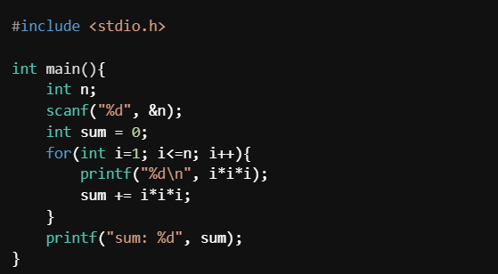
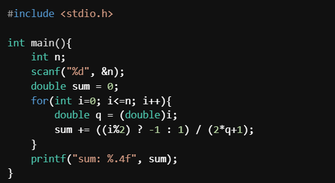

[Back to Main](README.md) | [Previous Page](06-variables-more.md)

# Control Flow

> Actual programming starts here

> Note that we assume all codes are within `int main()` in this page

> There are some topics that are less important, they will be marked with `*` in the title. But we may need a slight understanding of it for the next parts.

## Branching

> If this do this, if that do that.

### `if`, `else if`, and `else` Statements

Syntax:

```c
//if
if(<expression>) {
    <statement_true > 
}

//if - else
if(<expression>) {
    <statement_true> 
} else {
    <statement_false> 
}

//if - else if - ... - else
if(<expression_1>) {
    <statement_true_1> 
} else if (<expression_2>) { //think about "else if" as one clause
    <statement_true_2> 
} else if (<expression_3>) { //you can add more else if  
    <statement_true_3>
} else { //else is optional, if you don't want to handle the "else" case it is also OK
    <statement_false>
}
```

If `expression` evaluates to a non-zero value, then `statement_true` is evaluated. 

In the second syntax, if `expression` evaluates to a non-zero value run `statement_true` otherwise run `statement_false`.

In the third syntax, if `expression_1` evaluates to a non-zero value run `statement_true_1`. Otherwise, check `expression_2`, if it is non-zero run `statement_true_2`. Otherwise, check `expression_3`, if it is non_zero run `statement_true_3` ... and so on. Finally, if all expressions are zero, then run `statement_false`

The following are some examples:

```c
//if - else
uint32_t money = 100;
if (money) { //evaluates to non-zero
    printf("I have $%d.\n", money);
} else {
    printf("I have no money.\n");
}
//Output: I have $100.

money = money - 100; //money is now 0

//if
if (money) { //expression evaluates to 0
    printf("I have $%d.\n", money);
}
//Console Output: (nothing)


int x = 95; //Let's say this is your exam grade out of 100

//if - else if - ... - else
if (x > 85) {
    // if x > 85 evaluates to true, this part is run.
    // otherwise, this part is skipped.
    printf("You can chill for the finals\n");
} else if (x > 70) {
    // some other code
    // only runs if (x > 85) is false and if (x > 70) is true
    printf("You might need to put in more effort\n");
} else if (x > 50) {
    //some other code 
    //only runs if (x > 85) and (x > 70) is false but (x > 60) is true
    printf("You have to to put in more effort\n");
} else {
    // some other code
    // only runs if all expressions above are false
    printf("You made a mistake by enrolling\n");
}

//nested if
int courses_enrolled = 5;
int credit_count = 18;

if(credit_count >= 18){
    printf("You need to ask for overload to follow this plan\n");
} else {
    if(courses_enrolled == 6){
        printf("6 courses in a semester might be too busy...\n");
    }else if(courses_enrolled > 3){
        printf("Ideal workload for this semester\n");
    }else{
        printf("Your workload is too light for this semester\n");
    }
}

```

### Extra Notes on the Syntax

Usually, we will put `statement` between curly braces `{}`, however if you `statement` is only one line, you may omit it. For example.

```c
if(1)
    printf("Hello World!\n"); //this is valid
```

Note that it will only affect the line right after it
```c
if(0)
    printf("Not printed");
printf("Still printed");
```

## Loops: `for` and `while`

> Keep doing it until...

### `while` Loop

Syntax:
```c
while(<expression>) {
    <statement>
}
```
As long as `expression` evaluates to non-zero at the beginning of each iteration, the program will keep running `statement`

For example:
```c
int x = 0;
while(x < 5){
    printf("x: %d\n", x);
    x++;
}
```

Let's analyze the trace:
```c
<expression>: x < 5 //0 < 5, true (non-zero)
<statement>: printf("x: %d\n"); x++; //Prints x: 0, then adds 1 to x, x=1
<expression>: x < 5 //1 < 5, true (non-zero)
<statement>: printf("x: %d\n"); x++; //Prints x: 1, then adds 1 to x, x=2
<expression>: x < 5 //2 < 5, true (non-zero)
<statement>: printf("x: %d\n"); x++; //Prints x: 2, then adds 1 to x, x=3
<expression>: x < 5 //3 < 5, true (non-zero)
<statement>: printf("x: %d\n"); x++; //Prints x: 3, then adds 1 to x, x=4
<expression>: x < 5 //4 < 5, true (non-zero)
<statement>: printf("x: %d\n"); x++; //Prints x: 4, then adds 1 to x, x=5
<expression>: x < 5 //5 < 5, false (zero)
```
Hence the output is:
```
x: 0
x: 1
x: 2
x: 3
x: 4
```

Another example:
```c
int x = 5;
int f = 1;
while(x!=0){
    f *= x;
    x--;
}
printf("f: %d\n", f);
```
The program will output `f: 120`, think about why.

Another example:
```c
while(1){
    printf("Don't give up\n");
}
```
This program will output `Don't give up` until you stop it (use `Ctrl + C` when you are stuck in an infinite loop)

This may look useless, however, actually our robots will usually run programs inside a while loop when it is running.

### `for` Loop

Syntax:

```c
for(<init_clause>; <boolean_expression>; <post_processing>){
    <statement>
}
```

* `init_clause`: This expression is run once before the loop begins. Usually, an iterator variable is declared and assigned here.

* `boolean_expression`: This expression is run before every iteration of the loop to determine whether the body of the loop would be run, or whether the loop ends here. Same as before, the body is run when this expression is a non-zero value.

* `statement`: The statement to loop.

* `post_processing`: This expression is run at the end of every iteration of the loop. Usually, the iterator is incremented or decremented here.

This might get confusing, let us give an example:
```c
//This is the standard way to loop through integers [1, x) in C:

int x = 5;
for(int i = 0; i < x; i++){
    printf("i: %d\n", i);
}
```
Let's analyze the trace:

```c
<init_clause>: int i = 0; //initialize looping variable
<boolean_expression>: i < x  //0 < 5 = true (non-zero)
<statement>: printf("i: %d\n", i); //i: 0
<post-processing>: i++ //i = 1 now
<boolean_expression>: i < x  //1 < 5 = true (non-zero)
<statement>: printf("i: %d\n", i); //i: 1
<post-processing>: i++ //i = 2 now
<boolean_expression>: i < x  //2 < 5 = true (non-zero)
<statement>: printf("i: %d\n", i); //i: 2
<post-processing>: i++ //i = 3 now
<boolean_expression>: i < x  //3 < 5 = true (non-zero)
<statement>: printf("i: %d\n", i); //i: 3
<post-processing>: i++ //i = 4 now
<boolean_expression>: i < x  //4 < 5 = true (non-zero)
<statement>: printf("i: %d\n", i); //i: 4
<post-processing>: i++ //i = 5 now
<boolean_expression>: i < x  //5 < 5 = false (zero)
<exit>
```
Hence the output is:
```
i: 0
i: 1
i: 2
i: 3
i: 4
```

More example:
```c
int x = 10;
int sum = 0;

for(int i=x; i>=0; i-=1){
    printf("i: %d\n", i);
    sum += i;
    i--;
}
printf("sum: %d\n", sum);
```
This program will output (think about why):
```
i: 10
i: 8
i: 6
i: 4
i: 2
i: 0
sum: 30
```

Another (weird) example (think about what will happen here or run it):
```c
int x;
for( ; ; printf("Oh no~") ){ //actually all these three statements are optional
  x = 42;
}
```

## `break` and `continue`

'loops' here refers to `while` loop, `do while` loop, and `for` loop. 

* `break;`

  This statement is only valid in loops and switch statements. It is used to exit the statement, _breaking_ the execution.

  Example:

  ```c
  for (int i = 0; i < 20; i++) {
      printf("i = %d\n", i);
      if (i == 3) break; 
  }
  ```
  The code exits the loop after it runs the line `break;`

  This will output:
  ```
  i = 0
  i = 1
  i = 2
  i = 3
  ```
  The trace:

  <details>

  <pre>
  [init_clause] int i = 0;
  [boolean_expression] i < 20 // = 0 < 20 = true (non-zero)
  [statement] printf("i = %d\n", i); //prints i = 0
  [statement] if (i == 3) break;  // 0 == 3 = false (zero), not breaking out
  [post_processing] i++ //now i is 1
  [boolean_expression] i < 20 [", i); //prints i = 1
  [statement] if (i == 3) break;  // 1 == 3 = false (zero), not breaking out
  [post_processing] i++ //now i is 2
  [boolean_expression] i < 20 // = 2 < 20 = true (non-zero)
  [statement] printf("i = %d\n", i); //prints i = 2
  [statement] if (i == 3) break;  // 2 == 3 = false (zero), not breaking out
  [post_processing] i++ //now i is 3
  [boolean_expression] i < 20 // = 3 < 20 = true (non-zero)
  [statement] printf("i = %d\n", i); //prints i = 3
  [statement] if (i == 3) break;  // 3 == 3 = true, hence it breaks out of the program and stops 
  </pre>

  <summary>Click to Reveal</summary>

  </details>

* `continue;`

  This statement is only valid in loops. It means jumping to the end of `statement` (think about the `}` at the end), which means the code will continue to the next iteration.

  Example:

  ```c
  for (int i = 0; i < 5; i++) {
      if (i % 2) continue; // jump to the end and skips printf
                           // i++ will run, then i < 15
      printf("i = %d\n", i);
  }
  ```
  This will output:
  ```
  i = 0
  i = 2
  i = 4
  ```

  The trace:
  <details>

  <pre>
  [init_clause] int i = 0;
  [boolean_expression] i < 5 // = 0 < 5 = true (non-zero)
  [statement] if (i % 2) continue; //i%2 = 0%2 = 0 (zero), not running continue;
  [statement] printf("i = %d\n", i);  // prints i = 0
  [post_processing] i++ //now i is 1
  [boolean_expression] i < 5 // = 1 < 5 = true (non-zero)
  [statement] if (i % 2) continue; //i%2 = 1%2 = 1 (non-zero), running continue;
  [jumps_to_the_bottom]
  [post_processing] i++ //now i is 2
  [boolean_expression] i < 5 // = 2 < 5 = true (non-zero)
  [statement] if (i % 2) continue; //i%2 = 2%2 = 0 (zero), not running continue;
  [statement] printf("i = %d\n", i);  // prints i = 2
  [post_processing] i++ //now i is 3
  [boolean_expression] i < 5 // = 3 < 5 = true (non-zero)
  [statement] if (i % 2) continue; //i%2 = 3%2 = 1 (non-zero), running continue;
  [jumps_to_the_bottom]
  [post_processing] i++ //now i is 4
  [boolean_expression] i < 5 // = 4 < 5 = true (non-zero)
  [statement] if (i % 2) continue; //4%2 = 2%2 = 0 (zero), not running continue;
  [statement] printf("i = %d\n", i);  // prints i = 4
  [post_processing] i++ //now i is 5
  [boolean_expression] i < 5 // = 5 < 5 = false; STOP
  </pre>

  <summary>Click to Reveal</summary>

  </details>

> We covered the materials needed for your **Homework 3**! You can access it [here](homeworks/hw03-print-shapes.md). Give it a try, good luck! 

## Self-Test

Q1. A Nested for Loop

Determine the output of the following program:

```c
for(int i=0; i<4; i++){
    for(int j=0; j<3; j++){
        printf("%d: %d\n", i, j);
    }
}

printf("END\n");

for(int i=0; i<2; i++){
    for(int j=0; j<3; j++){
        for(int k=0; k<2; k++){
            printf("%d: %d: %d\n", i, j, k);
        }
    }
}
```

<details>
<pre>
    1: 0
    1: 1
    1: 2
    2: 0
    2: 1
    2: 2
    3: 0
    3: 1
    3: 2
    END
    0: 0: 0
    0: 0: 1
    0: 1: 0
    0: 1: 1
    0: 2: 0
    0: 2: 1
    1: 0: 0
    1: 0: 1
    1: 1: 0
    1: 1: 1
    1: 2: 0
    1: 2: 1  
</pre>
<summary>Ans</summary>
</details>

Q2. 

Part (a) write a code to simulate that the sum of cubes:

$$\sum_{i=1}^n n^3 = 1^3 + 2^3 + 3^3 +... + n^3 = \left(\frac{n(n+1)}{2}\right)^2$$

First, write a program to list out all the numbers in the interval $[1, n]$ cubed. Then store the sum in a variable, and print it out in the format given below.

For example if the input:
```
7
```
is given to your program, it should display the following
```
1
8
27
64
125
216
343
sum: 784
```
You can check that $\left(\frac{7(8)}{2}\right)^2 = 784$. Try it with other numbers and verify it.

<details>



<summary>Ans</summary>

</details>

Part (b) Write a code to simulate the sum of the alternating reciprocal of odd numbers. That is:

$$\sum_{i=0}^n \frac{(-1)^{n-1}}{2n+1} = 1 - \frac{1}{3} + \frac{1}{5} - \frac{1}{7} + \frac{1}{9} - ... + \frac{1}{2n+1} \approx \frac{\pi}{4} \approx 0.7853$$

Note that $i$ is in the range $[0, n]$

Please let your sum variable be a `double` and when finding the reciprocal recall what you learn in casting. You need to run the simulation until the value of $n$ given as your input.

Verify that your answer is getting closer to $0.7853$ the bigger the input is.

Given the input `10` it should output: `sum: 0.8081`

Given the input `100` it should output: `sum: 0.7879`

Given the input `1000` it should output: `sum: 0.7856`

Given the input `10000` it should output: `sum: 0.7854`

<details>



<summary>Ans</summary>

</details>


Q3. Print Crate: Try to make a program that outputs the following:
```
Given n=1
@

Given n=2
@@
@@

Given n=3
@@@
@@@
@@@

Given n=4
@@@@
@@ @
@ @@
@@@@

Given n=5
@@@@@
@@  @
@ @ @
@  @@
@@@@@

Given n=6
@@@@@@
@@   @
@ @  @
@  @ @
@   @@
@@@@@@
```
<details>

```c
#include <stdio.h>

int main() {
    int N;
    scanf("%d", &N);
    for(int i=0; i<N; i++){
        for(int j=0; j<N; j++){
            if(i==0 || j==0 || i==N-1 || j==N-1 || i==j){
                printf("@");
            }else{
                printf(" ");
            }
        }
        printf("\n");
    }

    return 0;
}
```

<summary>Ans</summary>
</details>

---

This is the end of the neccesary Tutorial 0 materials (barely enough to survive). You can almost code everything with all the syntaxes taught above.

[Back to Main](README.md)

However, there are a few other control flow syntax that you may want to learn, for the reason of coding efficiency, code cleanliness etc.

[Continue to The Optional Part](08-optional-control-flow.md)
