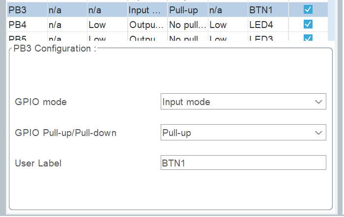
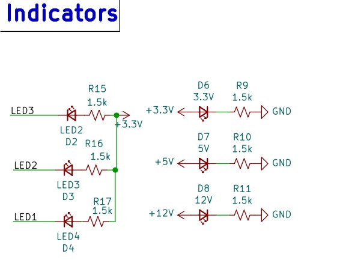
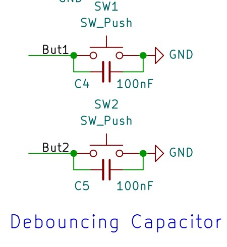

[Previous Page](1-Introduction.md)

# GPIO

## Introduction to GPIO

General-Purpose Input/Output (also known as GPIO) is a simple yet essential component in embedded systems. These digital spacial pin can read or send discrete signals, typically represented as HIGH (1) or LOW (0).

>Pins are the thin lines made of tin on the PCB, which connects the MCU to different ports and peripherals, facilitating communication between components.

- Every pin on the PCB can function as a GPIO pin.
  - These pins are organised into blocks of 16, referred to by letter: `GPIOA`, `GPIOB` etc
    - Within each blocks, the pins are organised by numbers: `GPIO_PIN_1`, `GPIO_PIN_2` etc
- This way, every pin can be referred to by their block and number, such as `PA1` or `PB10`.

For ease of use, you can define names for each pin inside the `main.h` file or directly within the CubeMX configuration.

## Configuration

1.  Configuring the Macros:

Under `Private defines`:

```c
/* Private defines -----------------------------------------------------------*/
#define BTN1_Pin GPIO_PIN_3
#define BTN1_GPIO_Port GPIOB
/* USER CODE BEGIN Private defines */
```

2.  Update the Pinout Name inside CubeMX

    <figure><figcaption></figcaption></figure>

    We renamed `PB3` to `BTN1` under the pinout user menu, this way, CubeMX will automatically generate the Macros.

## GPIO Read and Write Function

Using the `HAL` library and with the correct configuration, we can read inputs and send outputs.

### GPIO Input

The `HAL_GPIO_ReadPin` function reads the GPIO input given the pin and block. 

```c
/* stm32f4xx_hal_gpio.h */
GPIO_PinState HAL_GPIO_ReadPin(GPIO_TypeDef GPIOx, uint16_t GPIO_Pin);
// usage
uint8_t state = HAL_GPIO_ReadPin(BTN1_GPIO_Port, BTN1_Pin); // returns 0 or 1

//To Improve the Readability, recalling we have
    #define BTN1_Pin GPIO_PIN_3
    #define BTN1_GPIO_Port GPIOB
// Therefore you can make it easier on yourself:
#define gpio_read(gpio) HAL_GPIO_ReadPin(gpio##_GPIO_Port, gpio##_Pin)
// usage
uint8_t state = gpio_read(BTN1);
```

### GPIO Output

- The `gpio_set(gpio)` macro sets the GPIO pin to be 1.
- The `gpio_reset(gpio)` macro resets the GPIO pin to 0.
- The `gpio_toggle(gpio)` macro toggles the GPIO pin. (0 -> 1, 1 -> 0)

```c
/* main.h */
// Sets the GPIO pin to HIGH
#define gpio_set(gpio) HAL_GPIO_WritePin(gpio##_GPIO_Port, gpio##_Pin, GPIO_PIN_SET)
// Sets the GPIO pin to LOW
#define gpio_reset(gpio) HAL_GPIO_WritePin(gpio##_GPIO_Port, gpio##_Pin, GPIO_PIN_RESET)
// Toggles the GPIO pin
#define gpio_toggle(gpio) HAL_GPIO_TogglePin(gpio##_GPIO_Port, gpio##_Pin)

// usage
// Turns off the LED
gpio_set(LED1);

// Turns on the LED
gpio_reset(LED1);

// Toggles the LED
gpio_toggle(LED1);
```

### Buttons and LEDs

While 0 and 1 might mean something intuitively, we cannot guarantee what 0 or 1 means/does. 0 and 1 are just the 2 states that the pin receives/outputs, and both 0 and 1 can mean on in different circumstances.

<figure><figcaption></figcaption></figure>

When you set the `LED1` Pin to 1, the LED will actually turn off, and turns on when set to 0.

<figure><figcaption></figcaption></figure>

Similarly, for buttons, 1 is returned when released and 0 is returned when held.

To help reduce confusion and make your code more readable, we have provided the following:

```c
/* main.h */
#define led_on(led) gpio_reset(led) // set pin to 0 -> turn on LED
#define led_off(led) gpio_set(led) // set pin to 1 -> turn off LED
#define led_toggle(led) gpio_toggle(led) // change state of LED

#define btn_read(btn) !gpio_read(btn)

/* main.c */
// NOTE: the following still works
// btn_read exists to help you but you can still use gpio_read
uint8_t btn1_state = !gpio_read(BTN1);
```

In cases where the wires were swapped, you can change the defines instead of changing every single line of code.

## Examples

```c
/*main.c*/
while(1){
    if btn_read(BTN1){
        led_on(LED1)
    }else{
        led_off(LED1)
    }
}
```

^ this code turns LED1 on when BTN1 is pressed, otherwise, LED1 is turned off.

[Next Page](3-HAL_Clock.md)