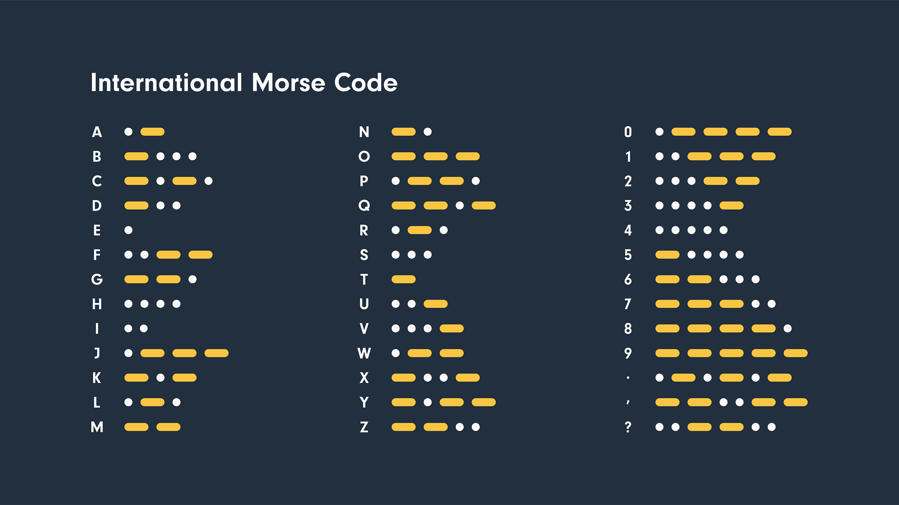

# T1: Homework

Tutorial 1 Homework

There will be 2 tasks.

Before you start doing homework, You may find these defines in `lcd.h` useful:

```c
#define CHAR_WIDTH 8
#define CHAR_HEIGHT 16

#define MAX_WIDTH 128
#define MAX_HEIGHT 160

#define CHAR_MAX_X_VERTICAL 16
#define CHAR_MAX_Y_VERTICAL 10

#define CHAR_MAX_X_HORIZONTAL 20
#define CHAR_MAX_Y_HORIZONTAL 8

#define CHAR_MAX_X 20  // max between CHAR_MAX_X_VERTICAL and CHAR_MAX_X_HORIZONTAL
#define CHAR_MAX_Y 10  // max between CHAR_MAX_Y_VERTICAL and CHAR_MAX_Y_HORIZONTAL
```

## Task 1: **Edge Triggering vs Level Triggering**

> Total: 11

#### **Part 1: Level Triggering**

- While the button is down, print `Hello, (Your name)` on TFT **(@1)**
- While it is not, turn on the LED (at least one LED). **(@1)**
- Two actions should not happen simultaneously.
- Hints:
  - In this case every time the loop comes around, we are concerned with the **current state** (or level) of the buttons GPIO Pin
  - The implementation of the button reading here should be obvious and simple

&#x20;

> Notice the green button and the green LED

#### **Part 2: Edge Triggering**

- We want to print `Hello, (Your name)` for 1 second when the button is pressed, but only once for each press, so holding the button does nothing more. **(@1)**
- The process repeats. i.e. it will print text again if you click the button. **(@1)**
- When the button is released, we want to turn on the LED for 1 second, but again only once for each release. **(@1)**
    - This implementation will cause such that if you press the button multiple times in short succession, you will extend the duration that the LED is on for and the time your name is displayed.
- Keywords:
  - The event of a signal going from low to high is called the _**rising edge**_ and the opposite is the _**falling edge**_
  - The `gpio_read()` macro gives us the current state, but edge triggering also requires knowledge of the **past state** as well as some logic
- Hints: How can we design some code that can call a function _only_ when the button is first clicked? (Rising edge)

#### **Part 3: Misc**

- Create a sprite in the middle of the screen. (Can be in any shape other than simple rectangle) **(@1)**
- It will move to the left for one `CHAR_WIDTH` when `BTN1` is clicked (Rising edge) **(@2)**
- If hold the BTN for >2000ms, the direction will switch, aka if you click the button , the sprite will go right for one `CHAR_WIDTH` instead **(@3)**
- You can display the direction that the sprite is going at the bottom of the screen for ease of debugging.


## Task 2: **Morse Code Generator: Words only**

> Total: 16

You will make a basic morse code input/output using what you've learnt in this tutorial and the online tutorial before.



In this task, we will only encode the letters A-Z (ignoring numbers or punctuation). Therefore you can assume the maximum of dots and dashes per character is 4. \
The morse code generator will only be change **VALID** encoded sequences into flashing lights.

Due to the limitations of the TFT screen size, the maximum number of letters an encoded word can have is 10. We will not try to encoded words with more than length 10.


I'll go over a self-defined unofficial term before I type the same thing over and over again.
> [] (Space character) will be used to represent white space character in places to clearly indicate where white spaces should be.

```c
char* MORSE[] =
{"._", // A
"_...", // B
"_._.", // C
"_..", // D
".", // E
"..__", // F
"__.", // G
"....", // H
"..", // I
".___", // J
"_._", // K
"._..", // L
"__", // M
"_.", // N
"___", // O
".__.", // P
"__._", // Q
"._.", // R
"...", // S
"_", // T
".._", // U
"..._", // V
".__", // W
"_.._", // X
"_.__", // Y
"__.." // Z
};

char* ALPHABET = "ABCDEFGHIJKLMNOPQRSTUVWXYZ";
```
These 2 arrays will be provided to you. (You can copy them and put them into your code if you want)\
(If so, go to `main.c` and scroll up, and put them below the lines `/* Private define ------------------------------------------------------------*/` and `/* USER CODE BEGIN PD */`)
- **Hint**: You might find writing a helper function to convert between the morse code and letters useful.
- You can use the function `tft_force_clear()` to clear the tft screen.

### Part 1: The Inputs

#### (a) Dots and Dashes

For quality of life and ease of debugging (and checking HW), we want you to display the dots and dashes on the TFT screen as you enter the inputs.

- When `BTN1` is pressed and held for <200ms (short), `". "` is inputted and shown on the TFT screen. **(@1)**
- When `BTN1` is pressed and held for <1000ms but >200ms (medium), `"_ "` is inputted and shown on the TFT screen. **(@1)**
```
- For short BTN1 press:
.[]
- For medium BTN1 press:
_[]
- The []s are a visual representation of a white space, in the actual HW, replace '[]' with ' '.
```

*Notice the 1 white space character after the dot and dash, will only give the point if the input and results are **completely** correct.


### Part 2: Validation

Since the intended outputs are only letters, we know that there will only be 4 or less dots or dashes. Therefore we impose a restriction on the input.

- Only a maximum of 4 dots/dashes can be used per character. **(@1)**
  - @0 if an encoded sequence has more than 4 dots/dashes
```
- If you do 4 short BTN1 presses and 1 medium BTN1 press
. . . . _ WRONG
- Due to the 4 character limitation:
. . . . CORRECT
```

The generator will validate the dot/dash sequence every time a new line is inputted or when the complete input is sent for outputting.

- When `BTN1` is pressed and held >1000ms and the lowest codestring is unvalidated, the display goes onto a new line (also resets the 4 dot/dash requirement). **(@1)**\
(@1 **only if** after a short BTN2 press, following dots and dashes are applied on a new line)

```
- Validated code strings
. _ _ _  J
_        T
- Unvalidated code strings (aka no letter on the right side)
. _ _ .       // even though this is the codestring for P, it has not been validated because there is no P next to the codestring.
. _ . _       // this is just an invalid codestring.
```

- Check if the string sequence is valid **(Total @5)**
  - If valid, show the corresponding letter next to the sequence (right side). **(Total @3, @2+@1)**
    - @2 for correct letter for all cases, @1 if a mix of wrong and correct letters, @0.5 if displays the wrong letter, @0 if fails to display any letter.
    - @1 for correct placement of letter (right side of dots/dashes), @0 if wrong position.
  - If invalid, delete the entire sequence up til the previous line. **(Total @2, @1+@1)**
    - @1 if can successfully detect invalid string. (aka does not show letter when the encoded sequence is invalid)
    - @1 if can successfully delete the invalid sequence, @0.5 if delete more/less than required, @0 if deleted nothing.

#### Example of what would appear on the TFT screen for 2 sets of responses:
```
- Screen before BTN1 hold of 1000ms
. . . .
- Screen after BTN1 hold of 1000ms
. . . .  H

- Screen after more inputs 
. . . .  H
. _ _    W

```

#### Example of invalid inputs:
```
- Screen before BTN1 hold of 1000ms
_ . _ .  C
. _ . _
- Screen after BTN1 hold of 1000ms
_ . _ .  C

```


### Part 3: Outputs

The final part is the final output results

- When `BTN1` is held for >1000ms and there is no unvalidation code string, send the input up for outputting. **(@1)**\
(@1 if LED flashes after this button is pressed + has input on screen, @0 otherwise)


Output goes as follows:
  - Dot: LED on for 250ms
  - Dash: LED on for 750ms
  - Space: LED off for 1750ms
  - Gaps between dots/dashes: LED off for 750ms


When the input is `sent`, output all the listed dot and dash sequences as flashes using any 1 `LED`. **(Total @2, @1+@1)**
  - @1 if dots and dashes are correct, @0.5 if length of flashes is inconsistent, @0 if dots and dashes are indistinguishable.
  - @1 if spaces and gaps are correct, @0.5 if length of flashes is inconsistent, @0 if spaces and gaps are indistinguishable.

After the input is `sent`, clear everything on screen and display the decoded word. **(Total @3, @2+@1)**
  - @2 if **ONLY** the correct string is displayed on screen
  - @1 if all input methods are disabled during the output. @0 if the button changes the TFT screen during output.

After the Morse Code finishs flashing, initialise everything to be ready for input again. **(@1)**

#### Example of output
```
- Before holding button for 1000ms
_ _      M
_ _ _    O
. _ .    R
. . .    S
.        E

- After holding button for 1000ms
MORSE 
- Also flashes MORSE in morse code
```


