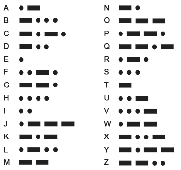

# T1: Homework

Tutorial 1 Homework

There will be 2+1 tasks.

Before you start doing homework, You may find these defines in `lcd.h` useful:

```c
#define CHAR_WIDTH 8
#define CHAR_HEIGHT 16

#define MAX_WIDTH 128
#define MAX_HEIGHT 160

#define CHAR_MAX_X_VERTICAL 16
#define CHAR_MAX_Y_VERTICAL 10

#define CHAR_MAX_X_HORIZONTAL 20
#define CHAR_MAX_Y_HORIZONTAL 8

#define CHAR_MAX_X 20  // max between CHAR_MAX_X_VERTICAL and CHAR_MAX_X_HORIZONTAL
#define CHAR_MAX_Y 10  // max between CHAR_MAX_Y_VERTICAL and CHAR_MAX_Y_HORIZONTAL
```

## Task 1: **Edge Triggering vs Level Triggering**

Consider 2 uses for a single button: (choose BTN1 or BTN2)

#### **Part 1: Level Triggering**

- While the button is down, print `Hello, (Your name)` on TFT **(@1)**
- While it is not, flash the LED (at least one LED). **(@1)**
- Two actions should not happen simultaneously.
- Hints:
  - In this case every time the loop comes around, we are concerned with the **current state** (or level) of the buttons GPIO Pin
  - The implementation of the button reading here should be obvious and simple

&#x20;

> Notice the green button and the green LED

#### **Part 2: Edge Triggering**

- We want to print `Hello, (Your name)` for 1 second when the button is pressed, but only once for each press, so holding the button does nothing more. **(@1)**
- When the button is released, we want to flash the LED for 1 second, but again only once for each release. **(@1)**
- The process repeats. i.e. it will print text again if you click the button. **(@1)**
- Keywords:
  - The event of a signal going from low to high is called the _**rising edge**_ and the opposite is the _**falling edge**_
  - The `gpio_read()` macro gives us the current state, but edge triggering also requires knowledge of the **past state** as well as some logic
- Hints: How can we design some code that can call a function _only_ when the button is first clicked? (Rising edge)

#### **Part 3: Misc**

- Create a sprite in the middle of the screen. (Can be in any shape other than simple rectangle) **(@1)**
- It will move to the left for one `CHAR_WIDTH` when `BTN1` is clicked and released,
- move to the right for one `CHAR_WIDTH` when `BTN2` is clicked and released. **(@2 for both short press)**


## Task 2: **Morse Code Generator**

You will make a basic morse code input/output using what you've learnt in this tutorial and the online tutorial before.



It will only accept morse code for A-Z (ignore numbers or punctuations). Therefore you can assume the maximum of dots and dashes per character is 4. \
The morse code generator will only be change **VALID** morse code strings into flashing lights.


I'll go over some self-defined unofficial terms before I type the same thing over and over again.
> Short Press (Duration < 200ms) \
> Medium Press (Duration > 200ms, < 1000ms) \
> Long Press (Duration > 1000ms) \
> [] (Space character)

### Part 1: The Inputs

#### (a) Dots and Dashes

- When `BTN1` is pressed (short), `.` is inputted and shown on the TFT screen. **(@1)**
- When `BTN1` is pressed (medium), `_` is inputted and shown on the TFT screen. **(@1)**

For quality of life and ease of debugging, we want you to display the string of dots and dashes on the TFT screen as you do the inputs.

- When `BTN2` is pressed (short), a space [] is inputted and the display go onto a new line. **(@1)**

This will be the indication of the end of the dot/dash sequence, aka 1 character.
I'll use [] to indicate a space, but in the actual code, use a white space character instead of [].

#### (b) Others

- When `BTN1` is pressed (long), clear the inputted dots and dashs up to the previous space character. **(@1)**
- When `BTN2` is pressed (medium), send the input up for outputting. (-)
- When `BTN2` is pressed (long), clear everything.  **(@1)**

### Part 2: Validation

The generator will validate the dot/dash sequence every time a [] is inputted or when the input is sent for outputting.

- Only a maximum of 4 dots/dashes can be used per character. **(@1)**
- Check if the string sequence is valid
  - If valid, show the corresponding letter next to the sequence. **(@2)**
  - If invalid, delete the entire sequence up til the previous space. **(@1)**

### Part 3: Outputs

Output goes as follows:
  - Dot: LED on for 250ms
  - Dash: LED on for 750ms
  - Space: LED off for 1750ms
  - Gaps between dots/dashes: LED off for 750ms

When the input is `sent`, output all the listed dot and dash sequences as flashes using `LED1`. **(@3)**\
After the input is `sent`, clear everything on screen and display the outputted word using latin alphabets. **(@3)**


