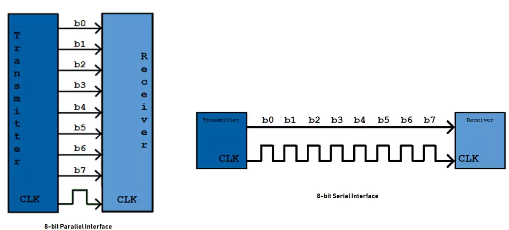
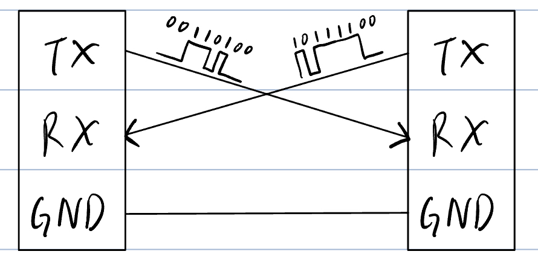
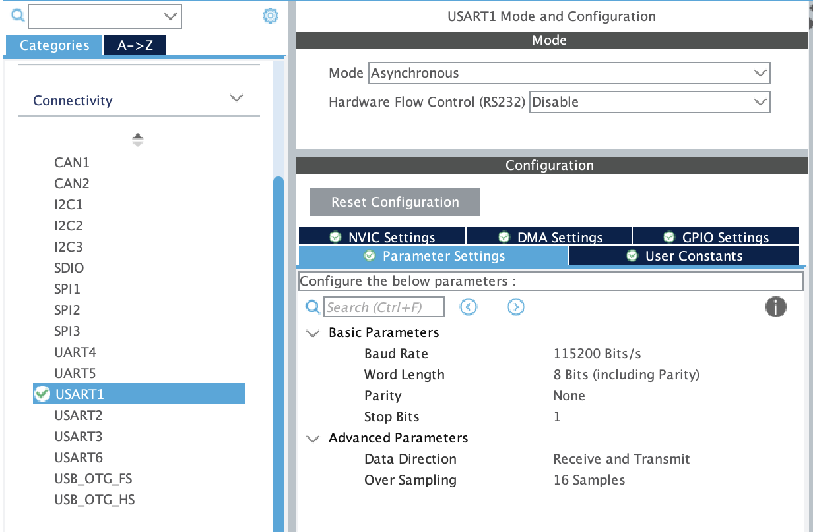
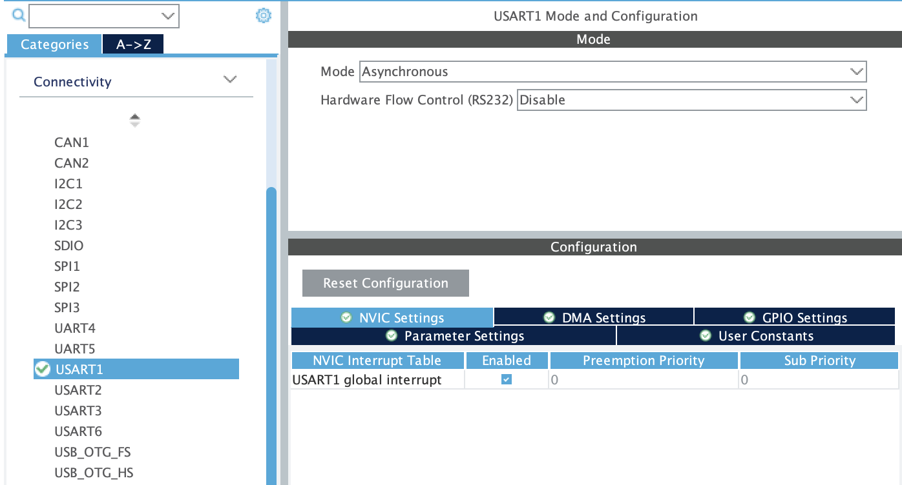

# UART

[Back to Main](./README.md)

> Author: Ken Law (cclawad@connect.ust.hk)

## Intuition

In tutorial 1, you have already learnt how to control buttons and LEDs on the mainboard, it is a kind of information exchange between you and MCU. However, what about data transfer between 2 MCU? Or even send data from the MCU to your computer for debug purpose?

## Introduction

Suppose you want to send 8-bit data from one board to another. Using the simplest parallel communication method, you’d need 8 wires—one for each bit:



This quickly becomes impractical as data width increases. For example, sending 32 bits would require 32 wires, just for one-way communication. To solve this, we use **Serial Communication Protocols** like UART, which allow devices to communicate efficiently with far fewer wires.

## What is UART?

UART (Universal Asynchronous Receiver-Transmitter) is a simple and popular serial communication protocol. It allows microcontrollers like the STM32 to send and receive data using just three wires: TX (transmit), RX (receive), and GND (ground). Unlike parallel communication, UART sends data as a **Stream of Bits**, reducing hardware complexity at the cost of transmission speed. UART is widely used for debugging, data logging, and connecting wireless modules such as Bluetooth.

> How is data represented as bit stream: [ASCII](https://en.wikipedia.org/wiki/ASCII) \
> It maybe helpful for homework task 3 :p

## UART Connections

To communicate via UART, connect the devices as shown below:



> The GND connection ensures both devices share the same reference voltage. Without a common ground, signals may be misinterpreted, so **always** connect GND between devices.

> Sometimes you may want to connect some module that has no power source on its own to the MCU. In this case, one more `5V/3.3V` wire is needed for powering the module with the MCU. (MCU 3.3V <-> module 3.3V)

## UART Configuration



To configure UART on STM32, open the `.ioc` file in the root directory of the project, go to `Connectivity > USART/UART X` and set the mode to `Asynchronous`.

> USART stands for Universal **Synchronous**/Asynchronous Receiver-Transmitter. Synchronous mode requires an extra clock line, while asynchronous mode (used here) relies on both devices agreeing on the baud rate.

UART transmits data in **Packets**. Each packet typically includes 1 start bit, 5–8 data bits, an optional parity bit, and 1/1.5/2 stop bits.


Most settings can remain at their defaults, except for the **Baud Rate**, which must match on both devices.

### Baud Rate

The baud rate defines how many bits are sent per second. Common values include:

- **9600**
- 14400
- 19200
- **38400**
- 57600
- **115200** (recommended)
- 128000
- 230400
- 256000
- 460800

`115200` is widely supported and fast enough for most applications. For example, with 1 start bit, 8 data bits, no parity, and 1 stop bit (10 bits total per byte), you can send 11,520 bytes per second at 115200 baud.

> **Always** set the same baud rate on both sides of the connection.

## Initializing UART Pins

Before using UART, you must initialize the relevant pins. This is usually handled in `main.c`:

```c
MX_USART1_UART_Init();
```

## Sending and Receiving Data

After initialization, use the STM32 HAL library function to transmit and receive data.

### Transmitting Data

```c
HAL_UART_Transmit(UART_HandleTypeDef *huart, uint8_t *pData, uint16_t Size, uint32_t Timeout);
```

- `huart`: UART handler (e.g., `&huart1`)
- `pData`: Pointer to the data to send
- `Size`: Number of bytes to send
- `Timeout`: Maximum time to wait in ms (Max: `0xFFFF` -> 65535ms)

**Example:**

```c
int main(void)
{
    /* Initialization */
    ...

    char msg[] = "Hello, World!";

    while (1)
    {
        HAL_UART_Transmit(&huart1, (uint8_t *)msg, sizeof(msg), HAL_MAX_DELAY);
        HAL_Delay(1000);
    }
}
```

### Receiving Data

```c
HAL_UART_Receive(UART_HandleTypeDef *huart, uint8_t *pData, uint16_t Size, uint32_t Timeout);
```

- `huart`: UART handler
- `pData`: Buffer to store received data
- `Size`: Number of bytes except to receive before timeout
- `Timeout`: Maximum time to wait in ms

**Example 1:**

```c
int main(void)
{
    /* Initialization */
    ...

    char msg[5];

    while (1)
    {
        /* Expecting to receive 5 char */
        HAL_UART_Receive(&huart1, (uint8_t *)msg, 5, HAL_MAX_DELAY);

        /* Echo Back */
        HAL_UART_Transmit(&huart1, (uint8_t *)msg, 5, HAL_MAX_DELAY);
        HAL_UART_Transmit(&huart1, '\n', 1, HAL_MAX_DELAY);
    }
}
```

**Example 2:**

```c
int main(void)
{
    /* Initialization */
    ...

    char msg[128];

    while (1)
    {
        /* Receiving, waiting for the msg for at most 100ms before jumping to main logic */
        HAL_UART_Receive(&huart1, (uint8_t *)msg, sizeof(msg), 100);

        /* Main logic */
        if (msg...)
        {
            ...
        }
    }
}
```

## Data transfer between MCU and computer

You can also communicate between the STM32 mainboard and your computer using a USB-to-TTL module.

> A USB-to-TTL module converts between the microcontroller’s TTL signals and the USB signals your PC understands.

[Serial monitor setting](./01a-serial-monitor.md)

## Blocking vs. Non-Blocking Communication

When calling `HAL_UART_Transmit()/HAL_UART_Receive()`, your code will pause at the function call until data is successfully transmitted/received as the MCU is continuously asking the UART hardware peripheral whether a byte is sended/received, this is called `blocking function`. This is unaccetably inefficient espesially for receiving data as most of the MCU resources are wasted for waiting data income. (FYI most main logic finish under 5ms, except for image processing)

For low speed situations, setting a relatively low `Timeout` as above is accpectable. But for most robotics task, we would like to run the main logic as frequent as possible. In some situations this is problematic, for example:

```c
int main(void)
{
    /* Initialization */
    ...

    char msg[128];

    while (1)
    {
        // Code will stop at here waiting for at most 100ms
        HAL_UART_Receive(&huart1, rx_buff, sizeof(rx_buff), 100);

        // Main logic that needs to be run once per ms
        main_logic();
        HAL_Delay(1);
    }
}
```

Therefore, instead of blocking function, we mainly use **Non-blocking Transmit/Receive Function**. Instead of let the MCU keep asking whether we have completed sending/receiving data, the non-blocking function will send a interupt signal to MCU if the UART hardware have completed sending/receiving a **Fixed Length** data.

> For receiving Variable Length message, plz check `HAL_UARTEx_ReceiveToIdle_IT()`, leave as self study material :p

### Enabling UART Interrupts

Here's how to activate the interupt function. Go to `Connectivity > USART/UART X -> NVIC Settings` in the `.ioc` file, enable `USART/UART X global interrupt` then click the gear button marked as `Device Configuration Tool Code Generation` right next to the `Run` button(the green circle with a white triangle inside).



### Non-blocking Transmit function

```c
HAL_UART_Transmit_IT(UART_HandleTypeDef *huart, uint8_t *pData, uint16_t Size);
```

`HAL_UART_Transmit_IT()` transmits the given data **In The Background Using Interrupt Mode**.

All parameter are the same as the blocking version.

When it finish transmitting the data, the UART transmit interrupt will be triggered. Then the `HAL_UART_TxCpltCallback()`(Cplt stands for complete) callback function is **Automatically** called, which allows you to perform any necessary post-transmission actions.

> Actually we seldom use `HAL_UART_Transmit_IT()` as for short data transmission it is unnecessary to use this kind of function, while for long data we have another function called `HAL_UART_Transmit_DMA()` which use DMA(Direct Memory Access) for effective data transmission.

**TX Example:**

```c
#include <string.h>

/* USER CODE BEGIN PV */
int transmit_completed = 0;
/* USER CODE END PV */

/* USER CODE BEGIN PFP */
// You need to write this function yourself, it won't be auto generated
void HAL_UART_TxCpltCallback(UART_HandleTypeDef *huart)
{
    if (huart == &huart1) // Better check the UART handler as different UART handlers share the same callback function
    {
        transmit_completed = 1;
        LED_ON();
    }
}
/* USER CODE END PFP */

int main(void)
{
    /* Initialization */
    ...

    char shakespeare[] = ...; // Contains thousands of bytes

    // Activate sending in background
    HAL_UART_Transmit_IT(&huart1, (uint8_t *)shakespeare, strlen(shakespeare));

    while (1)
    {
        // Comment the original transmit function
        // HAL_UART_Transmit(&huart1, (uint8_t *)msg, strlen(msg), HAL_MAX_DELAY);
        main_logic();
    }
}
```

### Non_blocking Receive function

```c
HAL_UART_Receive_IT(UART_HandleTypeDef *huart, uint8_t *pData, uint16_t Size);
```

`HAL_UART_Receive_IT()` **Starts Listening** to receive the expected length of data **In The Background Using Interrupt Mode**.

All parameter are the same as the blocking version.

When it finish receving the **Fixed Length** of data, the UART receive interrupt will be triggered. Then the `HAL_UART_RxCpltCallback`(Cplt stands for complete) function is **Automatically** called (but you need to manuly define it), which allows you to perform any necessary post-receive actions.

**RX Example:**

```c
/* USER CODE BEGIN PV */
char rx_buf[2];
/* USER CODE BEGIN PV */

/* USER CODE BEGIN PFP */
// You need to write this function yourself, it won't be auto generated
void HAL_UART_RxCpltCallback(UART_HandleTypeDef *huart)
{
    if (huart == &huart1) // Better check the UART handler as different UART handlers share the same callback function
    {
        post_receive_actions(rx_buf);

        // Start listening again
        HAL_UART_Receive_IT(&huart1, (uint8_t *)rx_buf, 2);
    }
}
/* USER CODE BEGIN PFP */

int main(void)
{
    /* Initialization */
    ...

    // Activate listening in background
    HAL_UART_Receive_IT(&huart1, (uint8_t *)rx_buf, 2);

    while (1)
    {
        // Comment the original receive function
        // Code will stop at here waiting for at most 100ms
        // HAL_UART_Receive(&huart1, rx_buff, sizeof(rx_buff), 100);

        // Main logic that needs to be run once per ms
        main_logic();
        HAL_Delay(1);
    }
}
```

### Place to put your own functions and variables

If you look close enough, you may saw that I have put all the `HAL_UART_TxCpltCallback()/HAL_UART_RxCpltCallback()` in something like

```c
/* USER CODE BEGIN XX */

/* USER CODE END XX */
```

This is because when you hit the gear button (`Device Configuration Tool Code Generation`), after generating the code required, the IDE will automatically delete all the stuff outside these BEGIN/END pair, even inside the `main()`.

```c
/* USER CODE BEGIN PV */
int test1; // Will stay
/* USER CODE END PV */
int test2; // Will be deleted

/* USER CODE BEGIN PFP */
int func1(){} // Will stay
/* USER CODE END PV */
int func2(){}; // Will be deleted
```

[Previous](./README.md) | [Next Page](./02-bluetooth.md)
