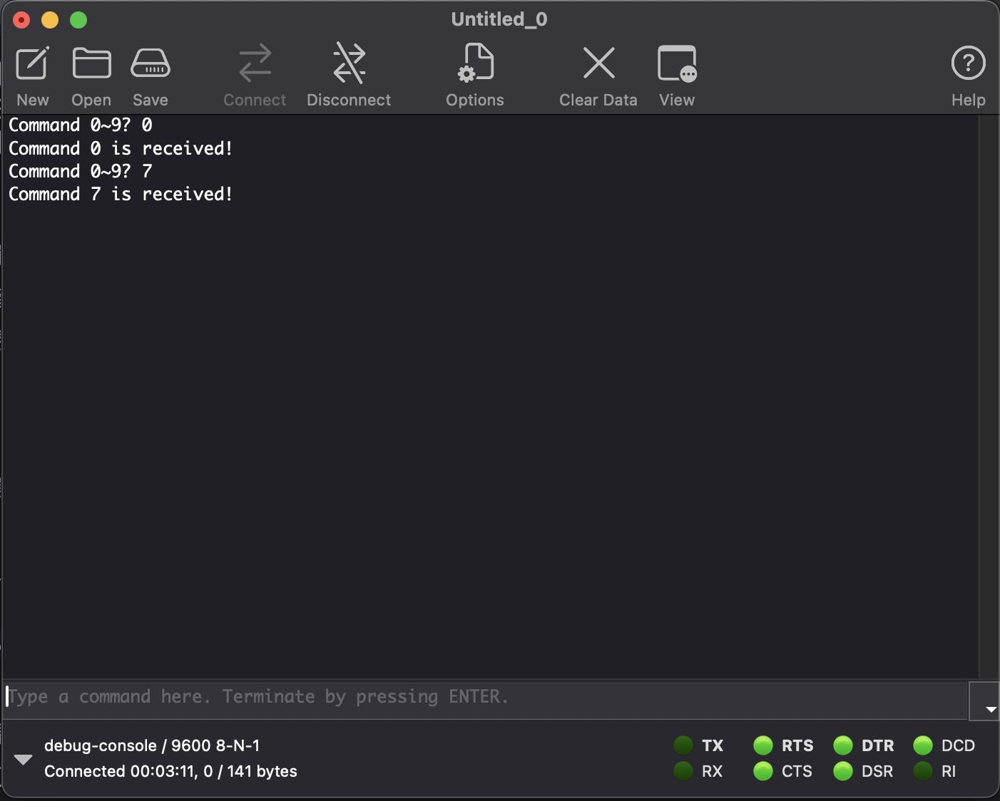

# Classwork

[Back to Main](./README.md) | [Previous Page](./02-bluetooth.md)

## Classwork #1: Receive command and give respond

What you should see in coolterm:

## Classwork #2: Repeat classwork #1 with bluetooth module

You have 2 tasks to be finished

- Show to our helper that you have correctly setup the HC-05
- Replicate classwork 1

## Classwork #3: Control LEDs by sending commands from computer to MCU through bluetooth.

Strings to send:

- Turn on LEDx: `+x`
- Turn off LEDx: `-x`
  - e.g. to turn on LED1: `+1`; to turn off LED3: `-3`.
- Toggle LEDx: `/x`
  - LED should keep toggling **every 500 ms** until a `+x` or `-x` command is sent.

[Previous](./02-bluetooth.md) | [Next Page](./04-homework.md)
