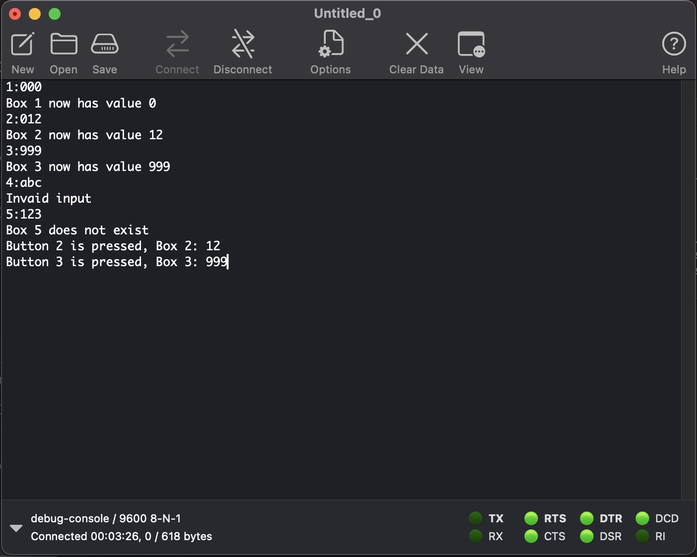

# Homework

[Back to Main](./README.md) | [Previous Page](./03-classwork.md)

## Task 1: Real-Time Button Status via Bluetooth

Configure your STM32 board to continuously send the status of all buttons to your computer using the HC-05 Bluetooth module every 100ms.
Format the data packet as follows:

`[Button 1: On/Off], [Button 2: On/Off], ... \n`

## Task 2: Bluetooth-Controlled Stopwatch

Implement a stopwatch on your STM32 board.
Your program should receive two commands via Bluetooth:

- `s`: Start/stop/resume the stopwatch
- `r`: Reset the stopwatch

After receiving each command, echo the command back to the computer via Bluetooth. Update the time on the TFT monitor every millisecond.

> You should display the time like you did in tutorial 1 classwork 2 with format of `mm:ss:sssZ` where sssZ means millisecond

## Task 3: Wireless Debug

Create 4 boxes (`int` variable) and change/view their value wirelessly.

- Change: the program should be able to recieve a FIXED length instruction with data packet like `X: YYY`, where `X` is the box no. and `YYY` is the value to be stored (`000~999`)
- View: When you press a button, the program should output the value of the corresponding box.

[Back to Main](./README.md) | [Previous Page](./03-classwork.md)
