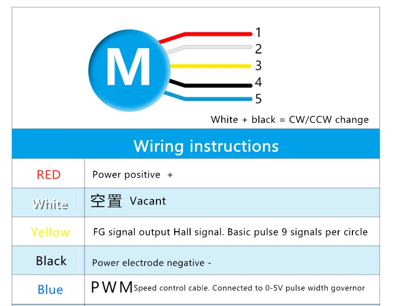

# SAMI Motor
>If you search SAMI motor on google, you will find an amazing motor embedded with a smart controller which is of course **NOT** what we will be using : ).

>At the end of this section, you will appreciate the fun and beauty of using this motor : ).

This Motor is a **Brushless(?) DC Geared** Motor that is controlled with PWM.\
We control the **speed** of the motor with **PWM**
and\
the **direction** of the motor with a **GPIO**.\
~~and we ignore the encoder cause I'm lazy~~

Simply speaking, the higher duty the PWM has, the faster the motor spins.

>If you want to know more about the motor, you simply can't since there is no official datasheet : (.

## Pin Layout

- Red: 24V supply
- White: CW/CCW direction ~~ignore the image, for some reasone it says its vacant..~~
- Yellow: Pulsed feedback
- Black: GND Ground
- Blue: PWM

**Classwork (Optional)**
Try to move the motor in both directions, and for each direction, 2 different speeds (1 slow, 1 fast as long as visibly different).

e.g. PWM duty cycle = 50% (0.5), dir = CW (Clockwise)
> It is suggested to at least try this out yourself since you will be using this motor in the RDC later.

## Optional
>some small potato yapping

>the following part will be mainly conceptual, we dont expect you guys to need to implement any of this stuff in RDC or even in the team.

The following parts may be less useful in general (hence optional) since we have never actually used this motor in the team before, but if you really want to use this motor or learn a bit more, feel free to check it out.

Also these are going to be purely conceptional. We dont expect any implementation.

### Encoder
>Although I did not want to deal with this, here we are.

The encoder provides feedback on the position of the motor in pulses.

Every rotation, it generates a certain number of pulses which we could count to estimate its distance travelled with respect to its start.\
Velocity could be estimated with some additional calculations as well.

According to some online vendor (since we have no datasheet : ) ), the SAMI motor is embedded with a HAL encoder which is supposed to generate 9 pulses per revolution. ~~but it gives weird feedbacks from our testing and we have no idea what its actual gear ratio is~~

#### Reading feedback
From the description, you may want to do polling/interrupt on the encoder pin to capture the encoder feedback, but there's actually a more efficient way of doing this with TIMers (actually still interrupts but implemented for you).

#### Back to TIMers
> Most useful part in this note imo.

In the PWM section, we used PSC, ARR, CNT & CCR of the TIMer to generate the PWM.\
Here we will be using mainly the counter CNT.

By scaling the count and change in count according to the settings of the motor, we could obtain a somewhat accurate reading of the position and velocity of the encoder with some extra steps.

The benefit of using TIMer is that it does the counting for you so it makes things more error prone and performance would be optimized for you, making it more efficient.

[Reference](https://deepbluembedded.com/stm32-timer-encoder-mode-stm32-rotary-encoder-interfacing/)
[Reference (in Chinese)](https://medium.com/%E9%96%B1%E7%9B%8A%E5%A6%82%E7%BE%8E/%E5%AF%A6%E7%94%A8%E5%B0%8F%E7%89%A9-rotary-encoder-with-stm32-timer-c31977c3ba84)

## Conclusion

~~Don't use this motor.~~
This motor is quite different form the ones we usually use which are controlled by current.

There is (likely) a control board embeded inside the motor handling control related matters, which would be really important in the development of robotics.

In short, we hope that you would dig more on control methods such as **PID**, and understand the importance of reading references datasheets for developing drivers/embeded systems.